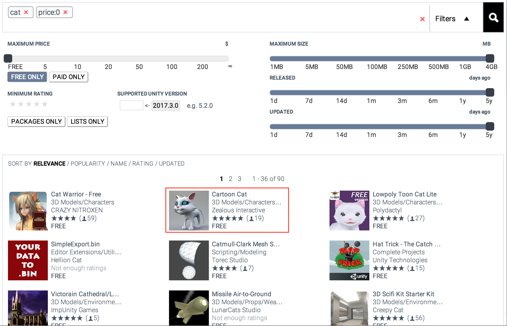
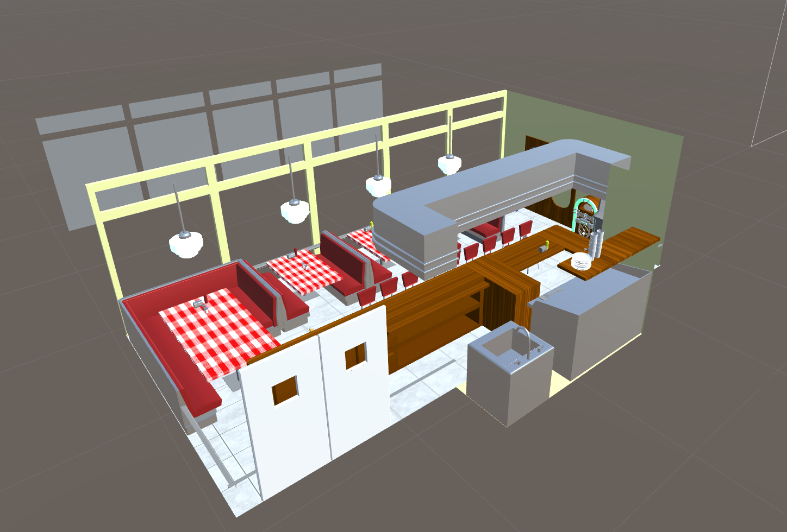
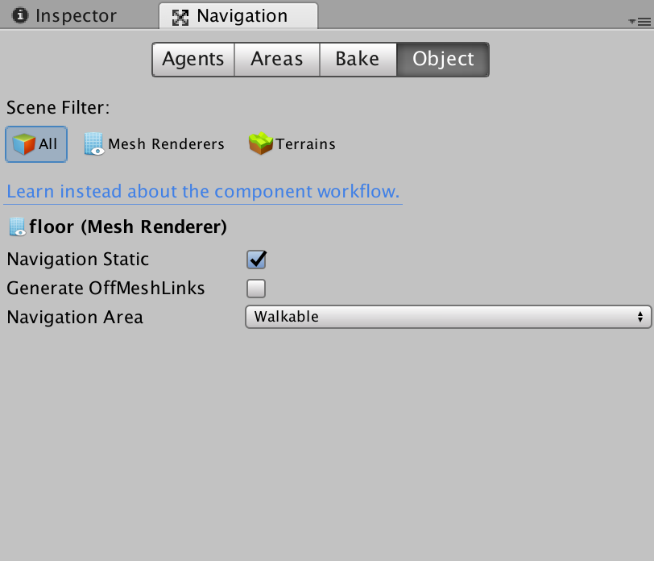

# Long assignment: Navigation

## Introduction

In this assignment, you will create a game where the player is trying to go around the scene grabbing or visiting some objectives and an enemy agent that will try to prevent the player from doing so. This will take the form of a bird player trying to get slices of bread spread around the scene while a devious cat tries to stop the player from doing so. The cat will be patrolling the locations where the slices of bread are located and, if the player gets too close, it will start chasing the player instead.

The game will end when the player either gets all of the bread slices or the cat catches the player.

## Assets
First things first: you will need to download the following assets to complete this assignment:

* Diner scene. **TODO add it from the library?/assets folder**.
* “FREE Food Pack” - free food asset pack for the bread. Import the toast prefab.

* "CAT” - It's probably easiest to import all.

* Bird models


Start by importing these.

## Scene overview

Your scene should contain the following by the end of this assignment:
  * A player model. We will use an animated bird model for this. The player will control this model with his keyboard.
  * An enemy model. We will use an animated cat model for this. It will patrol the waypoints and try to prevent the player from visiting them; cats don't like birds after all.
  * Multiple waypoints for the player to visit and the enemy to patrol. We will use bread slices for this.
  * An invisible game controller script that handles the high-level game functions, such as ending the game or keeping track of the player's score.
  * A camera that follows the player around. There are lots of objects all over the scene, which means we cannot use a static camera if we want to know where the player is.
  * Textured objects around the scene. When you download the scene, it will be all gray, but we will provide various textures for you to use.
  
## Building the scene

Let's start building the scene. The first thing you should do is place the diner on the scene. We have provided you with some materials you can apply to the scene so that it is not as gray. Go ahead and make the diner look lively first. Mine looks like this, but feel free to make yours look better.




Next, you will create and place the waypoints on the floor of the diner. 

### Waypoints

To create a waypoint prefab, drag a bread model onto the diner. Add a new script to this model, `WaypointController.cs`. This script should define a function that makes it obvious it has been visited by the player. Since the waypoints are bread, you can decide to make them invisible (but do not set them as inactive!) or apply a different material to change their look. This function will be called by the player from its own script when the player visits each waypoint. This script is created to maintain an abstraction between the player and the waypoint; the player should not control the rendering of the waypoint directly, but should instead tell the waypoint that they have visited it, and the waypoint should handle how to respond to this event. This should be the only function in the script and it will only be called from outside this class; in other words, this script does not need `Start()` or `Update()` functions.

Add a unique identifier to each waypoint. This identifier will be used by the game controller to keep track of which waypoints the player has visited. The easiest way to accomplish this is probably to define a `public int` variable in the controller and set it manually to a different number for each waypoint; this solution is not particularly clever, but it should suffice for our purposes. After you place your waypoints (and when you place more waypoints later on), **make sure each waypoint has a different unique identifier.**

Add a collider to your waypoint and make sure to set it to be a trigger, since we will use it in a similar way to how we did it in the Flappy Bird assignment. A capsule collider works fine, but make sure to increase the radius a little bit so it's not too difficult to detect.

Create a new tag and add it to your waypoint. We want this tag to be used for only the waypoints; we will make use of it later on to detect when the player gets each of the bread slices.

Place your waypoints in the scene. If you can’t see the bread models, they probably are under your floor; if that is the case, select them and in the inspector, increase their `Y` value. Make sure you create a waypoint prefab; it comes in handy later on.

### The enemy AI: the cat

Start by placing a cat model in the scene; you might have to adjust the scale. I recommend you start by placing `cat_Walk`, since it is easiest to debug the animations with this model. The cat will be mostly walking, after all.

#### Cat animation
Remember state machines from the 3D animation assignment? Yes, it’s time to bring them back again. We want to animate our cat so that it does something when it catches the player. This particular cat asset does not have many animations, so we will repurpose the animation for meowing; just pretend it’s roaring.

Add a boolean parameter to your animator, `playerCaught`. There is only one transition for this animator: going from the cat walking to the cat having caught the player, at which point the game ends; I’ll leave it up to you to make the transition; if you don't remember how transitions work, the notes for the 3D animation short assignment will remind you.

## Path-finding

We want the hostile cat to try to prevent the player from easily going around and eating all the bread. To do this, we will use of a classic behavior: patrolling. The idea is to have the cat go around checking the various points the player might go to. Furthermore, we want to avoid hardcoding the path ourselves; it would be difficult to precompute a path between the different waypoints a player might visit, and it would not be very extensible; what if we wanted to include an additional waypoint, or what if the enemy agent wants to deviate momentarily from this path and then come back?

To solve this, we will use Unity’s built-in pathfinding system. We need to first define which `gameObjects` are able to use the pathfinding system and where we want the enemies to be able to go.

To define who is an agent, i.e., who can use the pathfinding system, all we need to do is add a component to the `gameObject`s that we want to define as agents. In this case, the only agent is the player’s enemy--the cat. Add a **Nav Mesh Agent** component to the cat; leave the parameters unchanged for now.

Now we need to let Unity know where the cat is allowed to go. To do this, we will define a navigation mesh, or NavMesh. To do this, we will go to the *Navigation* tab next to the inspector. If you can’t see the tab next to the inspector, activate it by selecting *Window > Navigation* in the menu bar in MacOS. **TODO not sure how to do this on windows.**




There are four tabs in the navigation panel, which are mostly used to tune the various parameters of the navigation system; for now, select the floor on the Scene view and, in the object tab inside the navigation panel, check the *Navigation Static* checkbox. This is telling the navigation system that this object will not be going anywhere and the agents will be able to move through it to get to their destination.

Now, let’s have the agent go to one of the waypoints automatically. Add a new script to the agent, `EnemyController`.

```csharp
using System.Collections;
using System.Collections.Generic;
using UnityEngine;
using UnityEngine.AI;  /* For the NavMesh stuff */

public class EnemyController : MonoBehaviour {

    public Transform[] waypointArray;

    private int waypointIndex = 0;
    private NavMeshAgent agent;

    // Use this for initialization
    void Start ()
    {
        agent = gameObject.GetComponent<NavMeshAgent> ();
        // This is a good check to have, since it easy to overlook adding
        // the waypoints
        if (0 == waypointArray.Length) {
            Debug.LogError ("It seems you forgot to tell the agent about the waypoints");
        }
    }

    // Update is called once per frame
    void Update ()
    {
        if (1 > waypointIndex) {
            Debug.Log ("Hey yo");
            GoToWaypoint ();
        }
    }

    void GoToWaypoint()
    {
        Vector3 targetPosition = waypointArray [waypointIndex++].transform.position;
        agent.SetDestination (targetPosition);
    }
}
```

This is a very basic version of a pathfinding agent. It has a public array of waypoints. These are the waypoints the agent will patrol. For now, it only goes to the first one.

Select the waypoints and make sure their **Y** coordinate is pretty close to the ground; otherwise the agent might decide the waypoint is too far up in the air and not go to it; this doesn't have to be too precise, so don't worry if it it doesn't loko like it is directly on the ground, but it's something to be aware of if you're having issues debugging your agent's pathfinding. Select all the waypoints and add them to the agent’s waypoint array by dragging each of them to the cat’s `EnemyController` component:


Now press play and you should see the cat go one of the waypoint and remain there. If you see this, you have successfully defined a rough version of where the agent is allowed to go and hooked Unity's navigation system to your agent. That's a start!

For the next step, you should make this more general. Right now, the only time the cat will go to the array is if the index into the array `waypointIndex` is 0. You should change this so that the cat visits all the points in the array and then starts over from the first point. Remember the agent knows about the waypoints from the `waypointArray`. Once you get this working, the cat should no longer visit the first waypoint and then stop; instead, the output will probably look wrong, but don't worry. We will fix that in the next step.

Right now, in every frame we are changing the destination of our agent; we should instead make sure our agent reaches its destination before we direct it to the next one. To do this, wrap your call to `GoToWaypoint()` in the following check:

```csharp
if (!agent.pathPending && agent.remainingDistance < 0.5f) {
    GoToWaypoint();
}
```

Basically, we are checking whether the agent has made it to its destination before calling the `SetDestination` method again.

Now your cat should be happily going between waypoints and look something like this while doing it--ignore the animations, those will come later.


It's great that it now goes between waypoints normally, but on the other hand, it is going through obstacles. That is because we still have not told the navigation mesh where the obstacles are. To do this, select the bottom mesh of each booth, `boothBase#`, where `#` is a number, and go to the navigation panel. Once you are there, go to the object tab and select **Navigation Static**. Once you are done doing this with all the booth bases, select the floor again, go to *Navigation > Bake* and press the *Bake* button. If you want your agent to look a bit more realistic, increase agent radius a bit, to something like 0.2. What this does is to tell the agent to leave a little room while avoiding obstacles; it looks better in my opinion.

Now, your agent should have no problem avoiding obstacles.


Add a couple more waypoints throughout the diner and make sure your agent visits all of them. You should take this opportunity to make sure your agent properly avoids the booths by placing some of the waypoints below the tables.
You should make sure this works as intended before moving on to the next section; otherwise, it will be difficult to debug later on.

## Chasing the player

Patrolling is great, but we really want the agent to get in the player's way to prevent them from getting the delicious bread pieces. We want to incorporate this into the agent's behavior by first checking whether the agent is close enough to the player. If that is the case, the agent should chase them; otherwise, the agent should keep patrolling. If we keep doing this in the `Update` function, the entire code will pretty quickly devolve into a huge `if-else` ladder since there are a lot of checks to be done. This approach leads to code that is difficult to debug and leads to a performance drop-off if there are mulitple agents.

To fix this, we will introduce a new concept: finite state machines, or FSMs. If that is hard to remember, remember the initials of FSM are the same as those for the flying spaghetti monster.


You can think of a finite state machine as a machine that contains states, transitions between those states, an initial state, and a terminal state. For the purposes of game AIs, you can think of these as follows:
* Each state is the function telling the agent how to behave for a particular set of circumstances. For instance, how to behave if the player gets too close, how to behave if the player is close to an objective, how to behave when the game just started, and so on.
* Each transition is the set of conditions that will cause the agent to change from a state to another. For instance, if the player enters the agent's line of sight while it is patrolling, the agent should go into a chase state (and let the chase state handle what to do then).
* The initial state is the state the agent starts in.
* The terminal state is a state the FSM can end in. For this assignment, you can stop executing the FSM here. After the player is caught, there is no going back to any other states; the game is over.

This representation is useful to us because we can easily separate the behavior for different states (such as the state where the agent is chasing the player or the state where the agent is patrolling) from the transitions. This lets us write cleaner code and debug things more easily. If this reminds you of the animator controller from the 3D animation short assignment, that is because Unity animator controllers are exactly that: FSMs. The states are each of the individual animations and the transitions are defined as conditions that will result in a change of state. In our case, we used booleans to check whether the player was moving, sneaking, or idle as the conditions that would define the transitions, and different animations as the different states.


### Coroutines

"That's great and all, but we need to translate that into code," you might say. To do that, we will use coroutines. Coroutines are functions that return control to their caller and resume where they left off--as opposed to from the beginning, like most functions. Coroutines are useful because they allow us to code FSMs cleanly and because they allow for significant performance gains when games scale, such as when we have 100 agents; we don't want to check for their behavior *every* frame in the `Update` function; we might want to check every 0.1 seconds or when a particular condition is met.

If you want to understand a bit more why coroutines might be useful, consider another example not related to game development: you want to compute a list of a million boolean values and check if *any* of them is `false`. You could either compute the entire list and then check the values, or you could compute the values one by one and check the values as you go. With the latter approach, you can terminate when you first encounter a `false`. The second approach is preferable to the first one because chances are you will encounter a `false` value before you could compute all the values in the list. A coroutine comes in handy in here because it computes a single value and returns to the caller. The caller then decides whether it needs to call the function again; if it doesn't, it is done, but if it needs to compute the next value, it can call the function again knowing that it will resume where it left off, i.e., it won't re-compute the values it had previously computed.

For a more specific explanation to how coroutines may be used in game development and in Unity, I **highly** suggest you read [this Unity tutorial on coroutines](https://docs.unity3d.com/Manual/Coroutines.html). In short, a coroutine takes the following signature in Unity.

```csharp
IEnumerator Fade() {
    for (float f = 1f; f >= 0; f -= 0.1f) {
        Color c = renderer.material.color;
        c.a = f;
        renderer.material.color = c;
        yield return null;
    }
}
```

The `yield return null` is the instruction where the coroutine returns control to its caller and also the point where it will resume. In this particular case, the coroutine will change some color properties every time it is called. Next time it is called, it will keep changing the color, starting from where it left off (the end of a single iteration of the loop). This allows for the color to fade over multiple frames (which you could not do if you placed a `for` loop in a single call to update, since the entire progress of that loop would happen within a single frame and you would not see any fading, just a sharp transition.

Coroutines help us in creating changes to the game over several frames or a predefined period of time. If you wanted to have this object fade over a second, you could replace `yield return null` for `yield return new WaitForSeconds(0.1f)`. This would create a 0.1 second wait in between subsequent calls to the coroutine; since the loop runs 10 times, this entire process would take a second.

So, a FSM written with coroutines? Yes. To do this, you first want to think of what states this patrolling agent can be in (what the different situations the agent can be in, as well as how to behave in those) and what the transitions between those states would be (under what conditions the agent should change between those states). It is difficult to translate these states and transitions into code, so don't worry too much about that part for now; we will see how to do this in the next section. I suggest, however, that you think about this before you keep reading; I believe state machines are one of those concepts where you have to think about them and play with them to understand them.

### Our state machine

We want to create a state machine with a couple states at least: chasing and patrolling. I think it helps to have a third state: catching the player.

Which state should the agent start in? I'll let you figure this out.

A single state's coroutine might look something like this:
```
myBehavior()
{
    should state change = false
    while (!should state change) {
        update the value of should state change
        do state-specific things
        yield control to your caller
    }
    // at this point, we know chasing the player = true. We don't want to handle it here, though.
    // This state only handles patrolling behavior after all
    set the appropriate next state here
}
```
A few notes:
* You can think of the state-specific behaviors you want to call as the `do state-specific things` instruction. Handle setting destinations, changing animations, etc. here.
* `while (!should state change)` is effectively checking whether a transition needs to happen. If a condition that defines this state is no longer true, e.g., is the player too far, transition to a new state by modifying this value. Doing so will break out of the loop. At that point, you can decide which state you want to go to next (there can be multiple states that you can go from this particular state).
* Remember your coroutine does not restart each time from the beginning. `yield control to your caller` is where the coroutine will return each time it--so to speak--pauses running, but also where it will resume; this means that **your condition must be updated inside the loop**.

A terminal state might look something like this.
```
myTerminalBehavior()
{
    do state-specific things
    tell your caller FSM should be done
    yield control to your caller
}
```
A few notes:
* The terminal function tells its caller there is no need to keep running the FSM because the terminal state got to run. There is no need to loop since the terminal state will be called only once. This is not the general case with FSMs, but for this assignment, you can assume this is the case.

You might be puzzled by this caller that I have mentioned all over the place. The caller is a function that simply runs whatever function corresponds to the current state as long as the FSM has not finished.
```
FSM()
{
    while (!done) {
        call the function that tells the agent how to act for the current state
    }
}
```

```
states = [ chasing, patrolling, catchingPlayer ]
set the current state to the initial state

FSM()
{
    while (!done) {
        call the function that tells the agent how to act for the current state
    }
}

patrollingBehavior()
{
    should be chasing the player = false
    while (!should be chasing the player) {
        update the value of should be chasing the player
        do patrolling things
        yield control to your caller
    }
    // at this point, we know chasing the player = true. We don't want to handle it here, though.
    // This state only handles patrolling behavior after all
    set the appropriate next state here
}

chasingBehavior()
{
    should be chasing the player = true
    while (should be chasing the player) {
        update the value of should be chasing the player
        chase the player
        yield control to your caller
    }
    set the appropriate next state here
}

catchPlayerBehavior()
{
    catch the player
    handle any state changes needed to end the game (animations, let the game controller know player was caught)
    done = true
}
```

A couple notes here:

* The FSM works by having a manager function, so to speak, that runs as long as the game is not over. On every iteration of its loop, it calls the function that will handle the current state of the AI. You should call this function exactly once.
* You **must** update the check of your loop for each of the states that have a loop **inside** the loop because when the coroutine resumes, it will resume at the `yield` statement, which is inside the loop. As such, if you do not update your boolean value, the coroutine will forever think the value is whatever it was the first time you checked.
* `catchPlayerBehavior` is the terminal state; the game is done and there are no more transitions needed. This is done by setting `done` to true so the caller function stops calling the behavior functions.

## Tips about states

### Patrolling

* When do you want to transition from this state to a different one (probably chasing)? The easiest way is to check whether the player gets close enough to the agent. `Vector3.Distance()` might be helpful.
* What is the patrolling behavior? Have the agent go through all of the waypoints, just like we saw in the **path-finding** section.

### Chasing the player

How do we set the enemy agent to chase the player? We use Unity's pathfinding once again. To do so, continuously call the `SetDestination()` method to direct the agent to the current position of the player. You should do this as long as you are in the chase state. You should stop chasing the player if they get too far away. This is not a terminal state, so think about what the next state should be when this happens.

## The player

Now it's time to add the player to the scene. Add the robin bird model from the living birds/models folder to the scene; this will be the player. Add a `PlayerController.cs` script to your player; you want to be able to control the model from your keyboard here. You can go back and see how this works in the `PlayerController` for the 3D animation short assignment. If you want to take a different approach, `Input.GetAxis()` might come in handy to easily detect the direction of a movement based on your arrow keys.

Now go ahead and animate your player model. Create an animator controller for your player; you probably want a script that is fairly similar to the animator controller for the player in the 3D animation short assignment; after all, you want your player  to have idle and walking animations. You will also want to add a state for when the bird is caught--a convenient animation for this state is the dead animation. In addition to the boolean parameters to check whether the player is moving or idle, it might be useful to add a third parameter to detect when the bird is caught. You can set this parameter when the player is caught, when you handle that later.

Remember to modify the animations so they loop--except for the death animation; that would be weird--and uncheck the "Has Exit time" option for the transitions between animator states. If you don't recall the details, you can find a more detailed explanation in the 3D animation short assignment.

### The camera controller

Once you can control the player with your keyboard inputs, you should create a script to control the camera, `CameraController.cs`. Feel free to make it as complex as you want, but a simple script that maintains the same distance to the player at all times should suffice; this is not the main point of this assignment, after all. You can calculate the initial offset from the player to the camera in `Start()` and, on every `LateUpdate()` call, move the camera as needed to maintain this offeset.

### The animator 
We have now set up the player movement and the camera controller. Now, it's time to animate the player. Add an animator controller to the player, just like you did for the enemy cat. We want to have three states for our player animator controller: moving, idle, and dead. Think about the parameters you want to add to your player animator controller and when you should update them in your FSM or in the player controller. You can use the bird animations in the `living birds/animations` folder for the three states that you will need.

Add a collider to your player model. You will use this collider for two things:
1. To check whether the player reached the waypoints.
2. To check whether the enemy agent caught the player.

For the trigger colliders to work properly, i.e., tell you when two objects intersected, one of the objects must have a rigidbody as well; since you will be checking for player collisions with two different objects, and since it is standard practice to have the rigidbody on the moving object (the player) as opposed to the static one (the waypoints), it is a good idea to give the player the rigidbody. When you add the rigidbody to the player, you will notice that it will fall through the floor; to fix this, for this assignment you can disable gravity in the player's rigidbody, since there won't be any interactions that need it.

### Detecting when the player gets the bread slices

Now the player has a rigidbody and a collider, and each of the waypoints has a collider, a tag that is shared among all waypoints, and a unique identifier that is unique to each waypoint. This is all we need to detect when the player gets a bread slice. You should define the function `OnTriggerEnter(Collider other)` inside your player class. This function will be called when the player collides with a waypoint. This will allow you to detect when the player collides with *a* waypoint, but not *which* waypoint it collided with. We want to be able to tell apart which waypoint the player collided with because the player will win only when they have visited *all* the waypoints.

How should we go about doing this? Remember the unique identifier that each waypoint has? That is how we will tell the different waypoints appart. For a single waypoint inside the `OnTriggerEnter()` function, we can go from a `Collider` object to a `WaypointController` where the unique identifier is stored; the `GetComponent()` function, present in every game object, allows you to do that. You can see how to use it [here](https://unity3d.com/learn/tutorials/topics/scripting/getcomponent).

Once you have the unique identifier for the waypoint the player collided with, you can use this to keep track of which waypoints the player has visited. **You should not do this in the player class, however**, because this is terrible abstraction. The player itself should not know the state of the game. Instead, the state should be kept and updated by the game controller.

Before we talk about the game controller, however, we must find a way for the player to communicate this event to other classes, namely, the waypoint so it can change its appearance, and the game controller so that it can keep track of the state of the game, as we just discussed; we will come back to this after a brief discussion on the agent catching the player.

### Detecting when the agent catches the player

You can detect this similarly to how the player detects it has collided with a waypoint. Think in which class the `OnTriggerEvent()` call should go and then tell the game controller that the agent just caught the player. The game controller should then react to this information and end the game.

Remember to tell your player controller that they have been caught, so it can update its animation to show it has been caught.

I will tell you that a bug that is easy to walk into is to forget to add a tag to the class your controller is colliding with; remember that we added a "Waypoint" tag to the waypoints to detect when the player collides with them and only with them.

Now that we have discussed the events that require you to send information to other clases, let's talk about how to do that exactly.

# Sending messages between classes

Remember how we defined a function in the waypoint controller for the waypoint to visually display the player had visited it and how this function had seemingly no way to be called? This is where sending messages comes in. You can send a message from a class, such as the player controller, to another class, such as the waypoint controller. In this instance, when the player visits (collides with) the waypoint, the player wants to let the waypoint know that it was just visited. The player can then send a message that tells the waypoint controller to execute a particular function with whatever arguments the player wants. This is done through the `SendMessage()` interface. In our example, this might look as follows:

In `WaypointController.cs`:
```csharp
public class WaypointController : MonoBehaviour {
    ShowAsVisited()
    {
        // ...
    }
}
```

In `PlayerController.cs`:
```csharp
public class PlayerController : MonoBehaviour {
    void MyFunction()
    {
        // assume we have a reference to the WaypointController stored in the variable waypoint
        waypoint.SendMessage("ShowAsVisited");  // notice that this is the string name of the function, 
    }
}
```

If the function had arguments to it, we would pass the arguments to the `SendMessage()` call as well: `waypoint.SendMessage("MyFunction", arg1, arg2)`. This use of arguments is how the player will communicate which waypoint it just visited to the  game controller.

Within the `OnTriggerEvent()` function inside the player controller, use `SendMessage()` to let the waypoint it should change its appearance and, once you create your game controller class, to let the game controller know which waypoint the player just visited.

## GameController

Your game controller, `GameController.cs`, is the high level manager of the game. As such, it will keep track of when the game starts and ends (and whatever other information is needed to know this) and act upon this. It will also keep track of the score. Oh, yes, the player will have a score. Someone once said something about competitiveness bringing the best out of us; if you believe that, great! If not, at least keeping a score will teach you about game development.

The first and most important function of your game controller is to start and end the game, and keep the required information to know when to do so.

To do this, your game controller should know how many different waypoints the player should visit in order to win. You can create a public array of waypoints, but this would mean there would be two copies of this array (one in the enemy controller and one in the game controller) and it would be easy to forget to add the new waypoints in one of the arrays when you add new ones to the scene. A good way to solve this is to keep your array of waypoints in one place; since the enemy already has a reference to this game controller, I suggest you keep your array in the game controller and initialize it in the enemy controller when the game starts (as opposed to having the list built manually).

Knowing all the waypoints in the game controller allows you to check whether the player has visited all the waypoints. This is one of the ways in which the game ends.

How do you know when a player visits a waypoint? Remember the player will send a message to each individual waypoint when they visit it (so the waypoint can update its look when a player has visited it) and a message to the game controller telling it which waypoint it just visited (so the game controller can keep track of this). Your task is to create a function that will be called by the message sent to the game controller and will act upon the information contained in the message, i.e., the waypoint's unique identifier. The game controller should keep track of which waypoints the player has visited so far and, when the player has visited all of them, call the function to end the game. I'll leave ending the game if the cat agent catches the player up to you; 

The function that will end the game will show a screen containing a message, the score, and a restart button. First, a quick detour to talk about the restart screen, and then, we will come back to ending the game.

### Restart screen

This screen is pretty much the same as the restart screen you created in the Flappy Bird assignment. Go ahead and create a screen in the editor. Add a text element that tells the player the game is over and a text element that for now is just a placeholder. Also add a button to it, but this time do not delete the text child element; just set the text to *restart game* or something similar.

Make sure to set the screen to inactive *before* the game starts--see the Flappy Bird assignment for the Unity's lifecycle function that helps you do that--and set the screen to active when the game ends.

We still need to handle the OnClick event for this button; we will do the same thing we did for the Flappy Bird assignment: use the `SceneManager` to load the 0th scene. Remember to set what the 0th scene is going into *Build Settings > Add Open Scenes*. If you experience lighting issues after pressing your restart button, go into _Window > Lighting > Settings_. Disable  _Auto Generate_ and click _Generate Lighting_. **TODO this fix was from here https://answers.unity.com/answers/1148664/view.html. Make sure it still works/the problem is still there with the most recent version of Unity**.

You will need to change the text element in that you created in the restart screen depending on whether the player won or lost. If the player won, you should **dynamically** replace the text with a message telling the player they won and their score; otherwise, you should add a message that lets the player know they lost.

To do this, you might want a reference to the text element that you are about to change; this would be silly because we already have a reference to the restart screen and the text element is simply a child of the restart screen. You can instead use `GetComponentsInChildren` to access the text element.

```csharp
Text messageTextObj = restartPanel.GetComponentInChildren<Text> ();
```

If the object you call `GetComponentInChildren` has mulitple children, you could also get all of them with `GetComponentsInChildren` (notice the additional `s`), which returns an array that you can index into.

To handle the text element properly, you want to import `UnityEngine.UI` at the top of your file along with all the other imports. Then you can access the string in the `Text` element as `myText.text`. Change this string depending on how the game went. For now, just show a placeholder value for the player's score if they won.

### Score

For the score, we want to create a metric of how well the player did so that players who did better have bragging rights and players who did not have an incentive to come back. You can think of lots of different metrics for calculating how well the player did: did they visit the waypoints in a particular order, was the cat chasing them when they visited the waypoints, and so on. 

It might be useful to think of the time that it took players to gather all the bread slices; players that took longer probably did not do as well as players who visited all the bread slices more quickly. `Time.time` is useful if you want to go down this road.

You can also come up with your own, much more elaborate metrics.

### Potential extra credit
* A better scoring function
* A better camera script that knows how to avoid obstacles
* Use coroutines to create a time delay between the animation played when the agent catches the player and the restart screen shown; it would be nice to see the animations for a bit.
* Right now there are two public arrays of waypoints: one in the game controller and one in the enemy controller.


## What to turn in
* Your source files:
  * `CameraController.cs`
  * `WaypointController.cs`
  * `GameController.cs`
  * `PlayerConttroller.cs`
  * `EnemyController.cs`
* Your scene:
  * Make sure to include various waypoints that make it obvious your enemy agent avoids obstacles
  * Make sure to use the models for the player and enemy. Make sure to animate them so they walk when they are moving,
  stay idle when not, and act accordingly when interacting with one another (have the cat die, the cat roar or do something else)
  * More. 
 
## Some rubric inspiration
[ ] Player model transitions properly between animation states.
[ ] Enemy agent visits all waypoints
[ ] Enemy agent avoids obstacles on its way
[ ] Enemy agent stops patrolling to chase the player when the player is close enough--and goes back to patrolling once the player is no longer within its range.
[ ] Scene has materials/textures.
[ ] Camera follows the player and player can move with the keyboard.

## To do

[ ] Add the cat model explanations / animator

[ ] Remember to mention the player tag.

[ ] Update the screenshots for the cheese

[ ] Export the Maya model with the textures (or at least make it so that you don’t need to have Maya in your laptop)

[ ] Textures. Should I do that or walk them through it.

[ ] How to distribute assets? Just a Unity package? Git? 

## QUESTIONS

* When to compute the next state (at the beginning/end of the loop?)
* How to update the state with event-driven things.
* Manager for all the waypoints so that you don't need to keep updating all the references in all the scripts? (Agent
* Get the camera to follow the player, for the puzzle.
