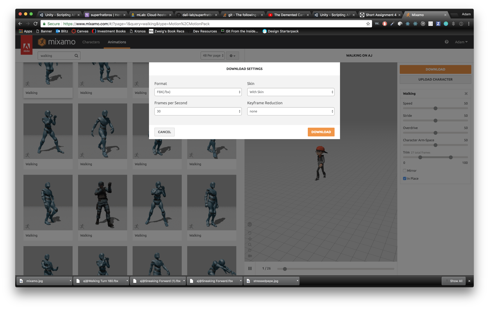
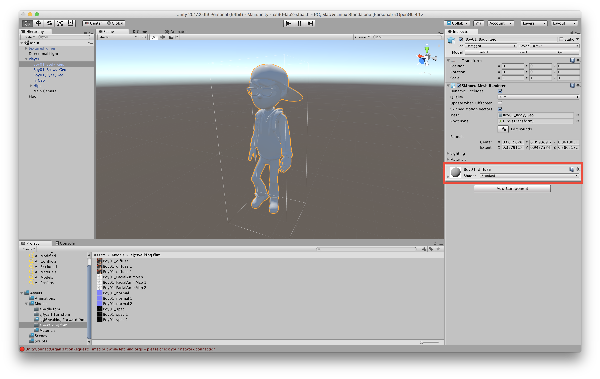
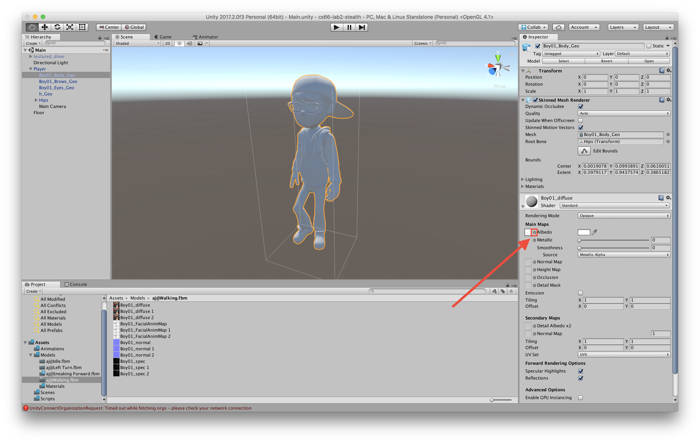
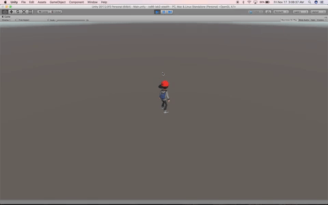
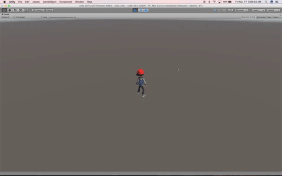

# 3D Animation


Welcome back! In this short assignment, we'll be walking through the basics of building animations into 3D projects. This short assignment will act as a starting point for our next lab, so everything you do here will be used in the next big assignment. Definitely make sure everything works now!

Luckily, we don't have to do anything too involved, as there's a great program out there that can provide us with a bunch of preset and rigged models with their own animations, from our friends at Adobe.


### Mixamo


Head on over to [Mixamo](https://www.mixamo.com/) and create an account (or use an existing Adobe account if you have one). Note: The site is **not** part of the Adobe Creative Cloud suite, and it is completely free for public use, for at least the foreseeable future.

Once you have the account set up, go ahead and click the "Characters" tab on the top menu. This will take you to a list of about 70 different character models. All of them are humanoid models, and they all have the same rig, so feel free to choose any one of them.

Once that's all set, you'll want to choose a starting animation for this character. Our next lab will be a sneaking game, and should involve two to three animations: a sneak, a walk, and possibly a run. To start, let's grab the walking animation. In the "Animations" tab, search for "Walking". Choose any of these that you want, preferably one that just resembles normal walking (there's everything here from combative walks to drunk walks).

Once you select one, you can preview it on the right side of the page. Make sure to check the box labeled "In Place", since we'll be doing all of the transform translations ourselves. If you're satisfied with your character-animation combo, hit the orange "Download" button.

Before you confirm the download, click the "Format" dropdown in the upper left corner of the dialog box.



Mixamo has its own specific formatting for Unity! Match made in heaven.

Select "FBX for Unity(.fbx)" and then click the download button.


### New Project
Create a new project in Unity. Once you have the new project set up, create a directory tree in the Assets folder, just like normal, but this time with the following folders:

- Animations
- Models
- Scenes
- Scripts

From your Downloads folder (or wherever your Mixamo FBX file ended up), drag the .fbx you just downloaded into the Models folder. This will unpack the .fbx file into two pieces: a GameObject prefab, and a .fmb directory containing the UV map for the various parts of your character (a UV map is essentially a flattening of a 3D shape's texture onto a plane).

The first thing you should do is drag your character prefab into the scene. Rename it "Player". You'll probably notice that it just looks like a greyed out version of the character you downloaded (if not, skip to the next section). That's because it needs to have its materials assigned, and this is where the UV map comes in.

Suppose you downloaded the model named "AJ". Then the prefab "AJ@Walking" would have five child GameObjects, something like "X_Body_Geo", "X_Brows_Geo", "X_Eyes_Geo", "h_Geo", and "Hips". Hips doesn't need UV mapping, but the other four (the body, eyebrow, eye, and lip geometries) do. Click on each of them individually (this is within the prefab, by the way, not the scene), and expand the material tab in the inspector, which should be the last one in the view.



Once that's open, click on the circle select button next to the property labeled "Albedo".



For the Body geometry, select the one that's something like "X_diffuse" (the diffuse geometry for the body), and for all others, choose "X_FacialAnimMap". Now it should actually look something like your character!


### Animations!
If you click on the parent GameObject in the scene, (should be named something like "X@Walking"), and then take a look at the inspector you'll see it has a component named "Animator", with a property called "Controller". Unfortunately, this property is currently set to "None" 😢 Let's fix that!

Right click on your Animations folder, and select Create > Animator Controller. This will create a new finite state machine, which will allow us to select which animations will be played at which times (given particular inputs, etc). Name the new controller something meaningful, like "Player", and double click on it. This will open up the Animator tab, which contains a barebones finite state machine. To start it off, drag in your Walking animation (which you'll find under your prefab in the models folder). By default, since this is the first animation in the FSM, it will be the default state (signified by an orange color).

Wait, that's not what we want! The default state should be standing still, not walking. Let's head back to Mixamo and find an Idle animation. Once you've found one you want, download it as FBX for Unity and drag it into your models folder again. Find the animation in the prefab that results, and then drag that into your animator controller FSM.

Great! Now, to make this the default state, right-click on Idle and select "Set as Layer Default State".


### Transitions
We now have two states in our FSM, but no way of getting to the Walking state. Add a boolean parameter called "Moving" in the parameters tab on the left of the FSM. Then, right click on the idle state and select "Make Transition", and then click on the Walking state. An arrow should appear pointing from the Idle state to the Walking state. Make another transition from Walking to Idle as well.

First, uncheck "Has Exit Time". Exit time allows for the current state animation to complete its cycle before transitioning. Often, this results in a major delay between states, so it's best to just not have it. Unity will interpolate the positioning of all of the skeletal joints to make the transition smooth anyway, so we don't really need to worry about the exit time.

Next, we want the animation to loop continuously, but by default animations play only once. To fix this, click on the parent GameObject in your hierarchy ("X@Idle") and go to the "Animation" tab in the Inspector. Near the bottom is a checkbox labeled "Loop Time". Check this box. Do the same for the Walking animation.

Finally, back in the animator controller, set the conditions for the state transition from Idle to Walking. We have just one parameter, so it should be pretty straightforward. In the "Conditions" list on the right of the FSM (you may have to scroll down a little), click the "+" icon, and select Moving > True. Do the same for the transition from Walking to Idle (but select Moving > False).

All of our animations are now set up! But they don't apply to anything yet. On the Player GameObject, drag the controller you just created (from the Animations folder) to the Controller property of the Animator component.

Great! Now we just have to set up some controls. I think we already know what the next section involves...


### Scripting

#### Player Controller
Create a new script on the parent GameObject of the model we've been animating. Call it "PlayerController". Open the script for editing, and paste in the following code:

```csharp
using UnityEngine;

/// <summary>
/// A basic player controller to affect movement of a 3D model. The controller follows the standard
/// RPG controller style, where the player moves relative to the camera.
/// Adam Rinehouse, Nov 2017
/// </summary>

public class PlayerController : MonoBehaviour
{
    public float rotationSpeed;     // the speed of player rotation
    public float moveSpeed;         // the speed of player motion

    public Camera mainCam;          // the main camera GameObject

    private Animator anim;          // the player's Animator

    void Start()
    {
        anim = gameObject.GetComponent<Animator>();
    }

    void Update()
    {
        // WASD Directional Input
        if (Input.GetKey(KeyCode.W))
        {
            MoveToDegree(0);
        }
        else if (Input.GetKey((KeyCode.A)))
        {
            MoveToDegree(90);
        }
        else if (Input.GetKey((KeyCode.S)))
        {
            MoveToDegree(180);
        }
        else if (Input.GetKey((KeyCode.D)))
        {
            MoveToDegree(270);
        }
        else
        {
            // if there is no WASD input, then the player is not moving
            anim.SetBool("Moving", false);
        }
    }

    private void MoveToDegree(int degree)
    {
        // get the current camera rotation along the y axis
        float camRot = mainCam.transform.eulerAngles.y;

        // detach the camera and rotate the player
        mainCam.transform.SetParent(null);
        transform.rotation = Quaternion.Euler(0, camRot - degree, 0);
        mainCam.transform.SetParent(transform);

        // move the player
        gameObject.transform.Translate(new Vector3(0, 0, 0.1f * moveSpeed * Time.deltaTime));

        // mark the Animator for a state transition, if applicable
        anim.SetBool("Moving", true);
    }
}
```

This code snippet moves the player according to the classic WASD free-camera RPG style, in which the player moves in four cardinal directions, using the WASD keys, relative to the camera. The `MoveToDegree` function does most of the heavy lifting, moving the player toward the intended direction of the key pressed.

We also want to have the Main Camera follow the player, but not when rotating (or else the camera would always appear at the same angle relative to the player), so we detach it from the player by setting its parent to null, then rotating the player, and then reattaching it is a child of the player. This requires that the camera be a child of the player to begin with, so make sure you set it that way in the hierarchy.

Once the script is saved, return to Unity and make sure to drag the appropriate reference to the Main Camera public variable, and assign some workable value to the Move Speed variable.

Once that's done, save the scene and press play. You should be able to move your character, and when it moves, it should be nicely animated!


#### Camera Controller
It's always nice in a third-person game to stand still and be able to look around without turning the player. To do that, we'll have to attach a script to the Main Camera. Do so, and call it "CameraController". Open it for editing. Paste in the following code:

```csharp
using UnityEngine;

/// <summary>
/// A simple class to controll camera rotation around the player object.
/// Adam Rinehouse, November 2017
/// </summary>

public class CameraController : MonoBehaviour
{
    public float turnSpeed;

    public Transform player;

    public float minHeight;
    public float maxHeight;

    void Start()
    {
        // ensure the camera is looking at the player to start
        transform.LookAt(player);
    }

    void LateUpdate()
    {
        // Only move if the left mouse button is pressed down
        if (Input.GetMouseButton(0))
        {
            // rotate the camera around the player if the mouse is scrolled horizontally
            transform.RotateAround(player.position, Vector3.up, Input.GetAxis("Mouse X") * turnSpeed);

            // move the camera vertically if the mouse is scrolled vertically
            transform.Translate(new Vector3(0, Input.GetAxis("Mouse Y") * 0.1f, 0));

            // clamp the vertical position
            ClampPosition();

            // look at the player
            transform.LookAt(player);
        }
    }

    /// <summary>
    /// Clamp the position of the camera in the y direction between values specified in the inspector.
    /// </summary>
    private void ClampPosition()
    {
        float x = transform.position.x;
        float y = Mathf.Clamp(transform.position.y, minHeight, maxHeight);
        float z = transform.position.z;

        transform.position = new Vector3(x, y, z);
    }
}
```

This basic script rotates the camera around the player and moves it vertically up and down, depending on the input in the horizontal and vertical directions of the mouse when the left mouse button is pressed. We also make sure to clamp the position of the camera so it does not get too far above or below the player (play around with these values in the inspector). Also be sure to set the turn speed, and drag the player GameObject into the appropriate place in the inspector.

Save the script, return to Unity, and press play. You should now be able to move the camera around with the mouse if you click and drag. You should also be moving relative to the camera, instead of relative to the global coordinate system.

N.B. If you want to invert the input axes for the camera control, you can do so in the Input Manager (click Edit > Project Settings > Input and it will appear in the inspector).


#### Sneaking
By this point, we've imported a model, attached two animations to it, and are able to move successfully. To finish off this short assignment, you should add another animation. Go back to Mixamo and look for a good sneaking animation, then import it just as you have with the other animations. Put it in your finite state machine, and draw transitions between all of the states, in both directions. Create a new parameter, "Sneaking", and set the transitions as appropriate for each state (you may need to update the previous ones to make them more specific as well).

Once you're all set, add in some code to the PlayerController script that allows you to enter "sneak mode" while holding down the space bar. The animation should change to a sneaking animation, and the speed of the player's movement should be cut in half. If you release the spacebar while pressing the WASD keys, the player should immediately go back to walking normally. If you press space without pressing other keys, nothing should happen.

This shouldn't be too much extra effort. My addition was only six lines of code, excluding curly braces.

Once you're done, test it out! Hopefully it looks something like these:






## And We Are Done!
We've successfully learned how to fully animate a character, and also how to control that character. Whether we control the character or not, though, I think we can appreciate how easy Unity makes it to attach animations. More than that, it's relieving to have a tool like Mixamo available to give us extremely high-quality animations completely for free.

Once you're finished up with the project, push all the code to your Github repo for this assignment.

## To Turn In
- Link to your Github repository, submitted to Canvas
- The repo should contain a short file `README.md` with three sections
	- What you did
	- What worked/didn't work
	- Any general comments/suggestions


## Extra Credit
There are many different things we can add to the animation, some just to improve it and some to make it really stand out. Opportunities are endless, especially with Mixamo at your disposal, so as always, get creative!

- Right now, the player just sort of teleports to different angle configurations. Can you add an intermediate turning state to make this a little smoother?
- The player can walk and sneak, but if they start getting chased, they need to be able to run away. Add in a running animation.
- It might be helpful if the player could jump as well.
- Throw in some obstacles and see if you can climb up on top of them.
- Add some other GameObjects as pickups (a stick, a guitar--you name it and the Asset Store probably has it) and animate picking them up and using them.

I and the graders are excited to see what you come up with!
