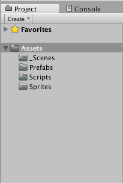
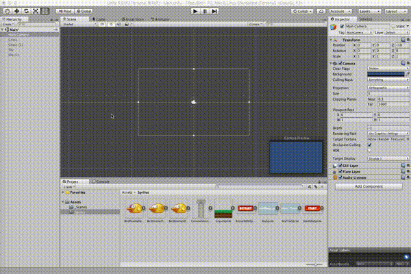
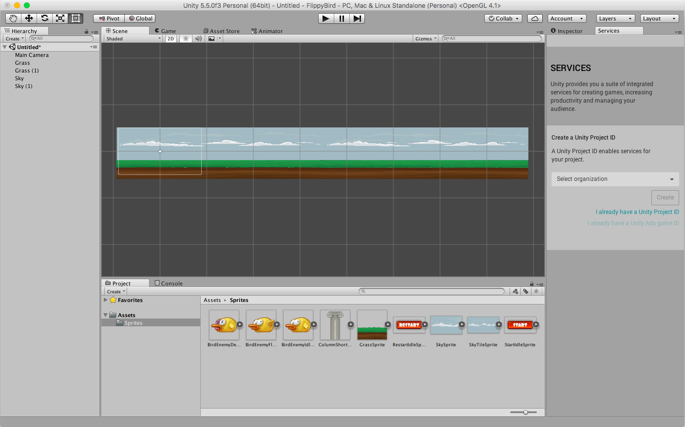
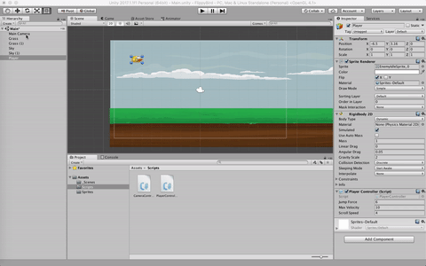
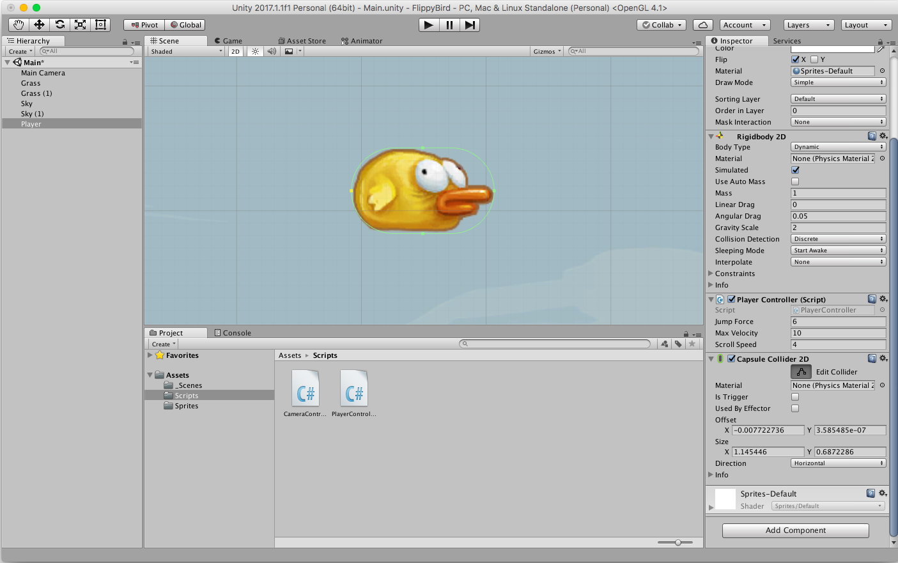
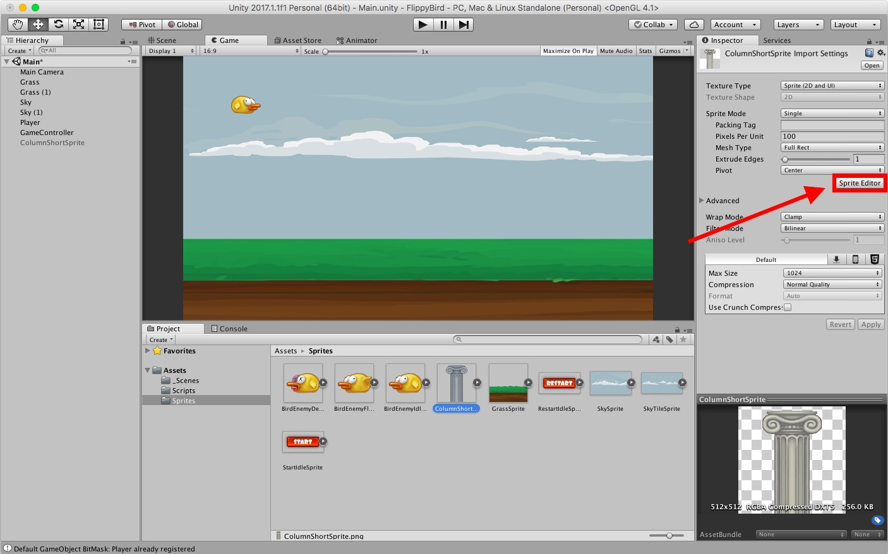
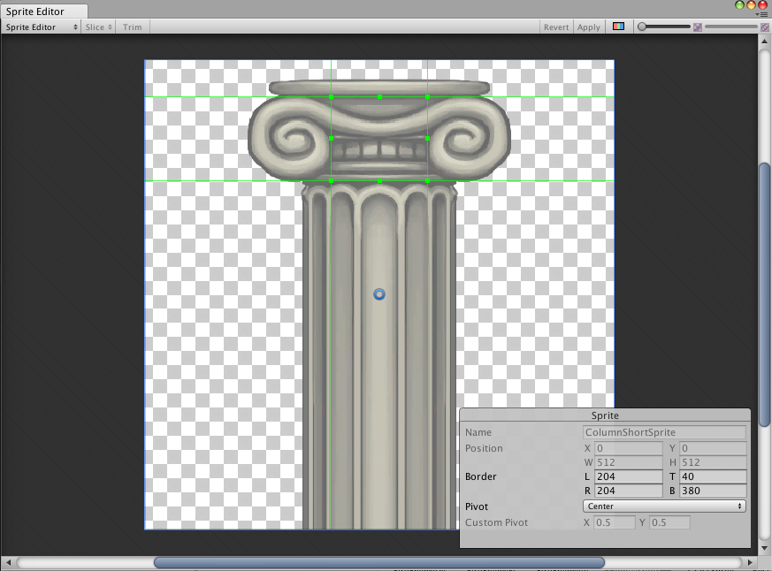
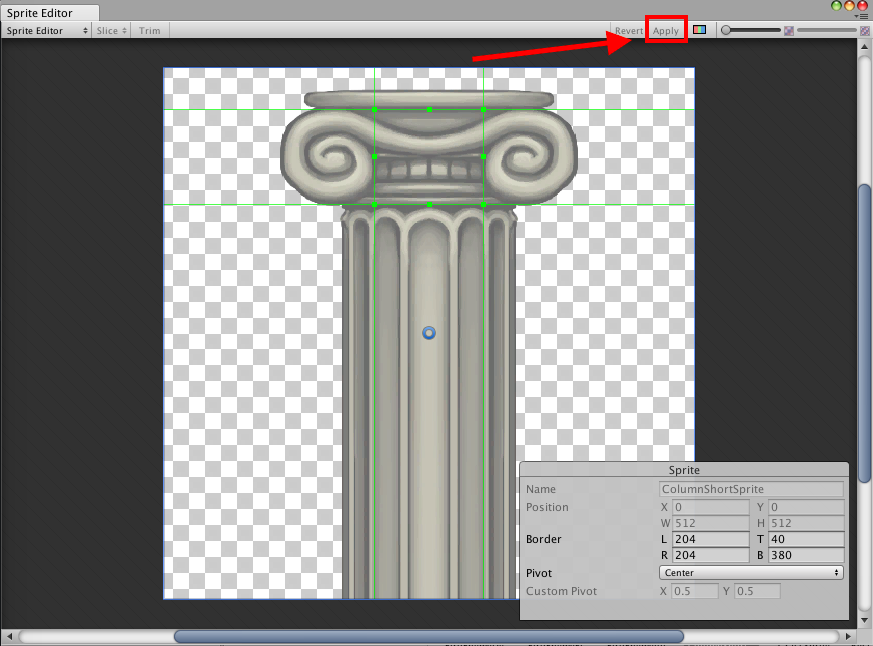
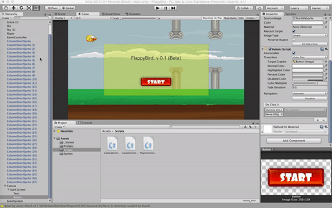

# Flappy Bird


Welcome back! In this assignment, we'll be designing our first full-fledged game, a clone of the cult classic, FlappyBird.

To start, make a new Unity Project (in 2D) and open it.

## Getting Started
### Setting Up Our Assets Folder
One thing we didn't quite cover in the last short assignment is best practices for organizing your Assets folder (since we didn't really have that many assets). As the projects get bigger, it helps a lot to keep everything nicely organized. Here's what my directory looked like at the end of the project:



I recommend doing something similar to keep all your assets in easily searchable spots. Note that "\_Scenes" has an underscore in it by convention, so that our scenes are always ordered first.

### Importing Assets
Let's start by downloading some assets from the Unity Asset Store. Navigate to the Asset Store tab (probably next to your Scene and Game View tabs). If it doesn't work on the first go, try flipping to another tab and back again.

Once there, search for "2D Sprites Pack". It should be the first result, free, and made by Unity Technologies. Hit the download button, and when the window pops up on your screen to import the assets, select only the eight we'll need for the assignment:

- BirdEnemyDeathSprite
- BirdEnemyIdleSprite
- ColumnShortSprite
- GrassSprite
- RestartIdleSprite
- SkyTileSprite
- StartIdleSprite

Hit import. Unity should automatically place these sprites in the `Sprites` folder that you created in the last step.

### A Few Notes On 2D
This is the first time we're working in 2D, but don't worry! This should in theory simplify things by removing a whole dimension, and it does.

The only thing to really watch out for is that when creating any physics components, we want to make sure we select them from the "Physics 2D", as the normal 3D versions might cause some problems that we don't want.

Also note that our camera works a little differently here. If you look in the camera's inspector, under the Camera component, you can see that the projection field is labeled "Orthographic". In the gif below, you can sort of see the difference. Essentially, an orthographic camera sees objects at a seemingly equal distance regardless of their distance from the camera itself (i.e. a box 300 pixels away will look the same size as a box 3 million pixels away.) In 3D we are used to the perspective camera, which is also shown in the gif, and makes things looks smaller as they get further and further away, as they do in our 3D real world.



## Background
Our background is going to have two parts, the sky and the ground. From the `Sprites` folder, drag the GrassSprite so mostly the grass is in the camera's field of view, and the SkyTileSprite so it covers the rest of the space. You can drag these out quite a bit, and then you can duplicate them with `command+d` on Mac or `control+d` on Windows and drag them out further. Mine looked something like this:



## The Player
FlappyBird is nothing if we don't have a player to lead us on our epic expedition through the never-ending obstacles. The provided bird isn't quite as heroic as our beloved 8-bit hero...


...but we do get something close enough. Drag the `BirdEnemyIdleSprite` into the scene, near the top left corner. Change its name to "Player" in the hierarchy view.

He's facing the wrong way! Easy fix. In the inspector, under the "Sprite Renderer" component, check the box under "flip" next to "X".

The player is going to need to handle some basic physics too. What do we need to add? If you guessed `Rigidbody`, you're close. Click "Add Component", and then click "Physics 2D" > "Rigidbody 2D".

Press the play button to test.

Our poor bird never learned to fly! Let's fix that.

Create a new script called "PlayerController". Open it up for editing. Paste in the following code:

```csharp
using System.Collections;
using System.Collections.Generic;
using UnityEngine;

public class PlayerController : MonoBehaviour {

	public int jumpForce;

	private Rigidbody2D rb2d;

	void Start () {
		rb2d = gameObject.GetComponent<Rigidbody2D> ();
	}

	void Update () {
		if (Input.GetKeyDown (KeyCode.Space)) {
			rb2d.AddForce(new Vector2(0, jumpForce * 100));
		}
	}
}
```

What's going on here? We create a public int called jumpForce, which is some value that we'll set in the editor. We also have a Rigidbody2D component that we initialize to point to the Rigidbody2D on the player object. (Recall that this script is attached to the Player GameObject. The `gameObject.getComponent` call will therefore get the component of the specified type that is also attached to this player GameObject.)

In `Update()`, we are just listening for any time the user hits the spacebar. When this happens, we add an upward force of 100 times our jumpForce.

Save the script and return to the editor. When you get back there, we'll have to change two values: "Jump Force" and "Gravity Scale". The former is in our script and determines the force with which we jump up. The latter is in the Rigidbody2D and determines how much gravity will pull our player downwards.

Play around with these values a bit and test until you find something you like. I used Gravity Scale 2 and Jump Force 6, but you may find something you prefer. Once you're satisfied, you should be able to hop in place after hitting the play button.


### Clamping Velocity
You might notice that if you hit the spacebar multiple times in close succession, the force we are applying makes the bird go up way faster than it should. This is because we are applying essentially a constant force over time. Recall that F=ma. Since force and mass are remaining constant, acceleration also remains constant, and a constant acceleration results in an exponentially increasing velocity.

We like realistic physics, but they have their place, and games like flappy bird ain't it. We want to make sure the player's velocity stays consistently in a specific range, so we want to `clamp` any value to that range. In your `PlayerController.cs` script, add in a public int `maxVelocity`, and add the following lines to your `Update()` function:

```csharp
rb2d.velocity = new Vector2(
  rb2d.velocity.x,
  Mathf.Clamp (rb2d.velocity.y, -maxVelocity, maxVelocity)
);
```

This sets the velocity of the player in each frame to stay the same in the x direction but clamps the y direction between the values of -maxVelocity and maxVelocity.

In the editor, play around with the values again until you find something you like, and press play to test.

### Moving Right
In the final game, there will be obstacles to avoid, and we'll want to move right so we can get to them. What's the best way to get this right-scroll behavior? The easiest is to just initialize the player character to have a constant rightbound velocity. (Recall that x and y velocities are independent of each other--if you have two bullets in a vacuum, you can drop one from ten feet up and fire another straight out of a gun from ten feet up and they'll hit the ground at the same time.)

In `PlayerController.cs`, add a public int called `scrollSpeed` and then add the following to the start function:

```csharp
rb2d.velocity = new Vector2 (scrollSpeed, 0);
```

In the editor, set the scrollSpeed to 4. Our bird should now be moving, so the next step is to get the camera to follow it.

## CameraController
There are a few ways that we can get the camera to follow our player. The quick-and-dirty way is to make the camera a child of the Player object. Since all children are spaced relative to their parents, the camera will move along with the player. Try it out! Drag the Main Camera in the hierarchy over the Player to make it a child of Player. Hit play!

Well, it's close. The camera is following the player all the time, though, and we want it to be fixed in the y-direction. We can't do that with parent-child relationships, but we can do it with a script.

Move the Main Camera back to its own position in the hierarchy. Then, with it selected, add a new script component to it in the inspector, and call it
`CameraController`. Open the script for editing.

Here's the code for the camera controller:

```csharp
using System.Collections;
using System.Collections.Generic;
using UnityEngine;

public class CameraController : MonoBehaviour {

    public GameObject player;

    private float offset;

	// Use this for initialization
	void Start () {
        offset = transform.position.x - player.transform.position.x;
	}

	// Update is called once per frame
	void Update () {
        transform.position = new Vector3(player.transform.position.x + offset, transform.position.y, transform.position.z);
	}
}
```

This gets the difference of the x coordinates between the player and camera on startup, and then in each frame updates the camera's transform position to move that offset in the x direction. This makes the camera appear fixed relative to the player, but only along the x-axis, which is just what we wanted.

Back in the editor, we're about to see one of the many cool things Unity can do. Recall that we set a variable `public GameObject player` in our script. Like any other public variable, we can set it in our editor. It wants a GameObject, and specifically we want it to point to our `Player` GameObject. With the Main Camera selected in the Inspector, simply drag the Player from the Hierarchy to the space next to Player in the Camera Controller script component. That was a lot of words. Here's a gif:



Couldn't be easier! Hit play and make sure it's working.

## Colliders
In any video game, there needs to be some notion of physical intersections. When a ball hits a player's foot, for example, the ball should respond to the kick by flying away from the foot. Or, when a daring plumber head-butts an inquisitive brick, a coin should emerge from the top. Unity's method of dealing with these collisions is the aptly named Collider.

Colliders are just components of any GameObject, with the special property that if two colliders meet, they should not be allowed to intersect into each other. They'll need to be on any objects that we want this property for, so if we want the bird to stop dead when he hits the ground, then both the player and the ground will need colliders.

### Capsule Collider
From the Player object's inspector, select Add Component > Physics 2D > Capsule Collider 2D. With the mouse over the scene view, press the F key to focus on the player object.

We want the collider to fit as closely as possible to the outline of the player. In the inspector, under the collider component, change the Direction dropdown to "Horizontal". At the top of that panel, click the button next to "Edit Collider". Then drag the top and bottom of the collider until they wrap nicely around the bird, like so:



### Box Collider
Now, do the same thing for the ground! Add a 2D box collider component to the grass sprite just like we did for the player, and wrap it so it fits nicely. The bottom doesn't really matter as much as the top.

Press the play button to test.

Hah, stupid bird. He just falls and gets stuck on the bottom. Don't worry, we'll fix right just now:

### Triggers


There's a special behavior of colliders that we want to utilize here: a trigger. Triggers are used when we don't want the standard collider behavior of bouncing off each other. We can set the ground to be a trigger so that when the player collides with it, it *triggers* some function like, say, a gameOver boolean switches to true.

To set this up, just check the box in the collider component labeled "Is Trigger".

### Tags
One other thing, before we get back to code. The trigger will need to be referenced somehow. The easiest way to do this is to add a tag to all trigger colliders that we consider obstacles. The ground is one, and the pillars will be the others. A tag is just a special property of a GameObject used for identification.

For now, in the ground object's inspector, at the very top, click the dropdown labeled "Tag", and select "Add New". At this new menu, click the "+" icon, and enter "Obstacle".

NOTE: You just created the tag, but you still have to apply it. Go back to the ground object's inspector and select "Obstacle" from the Tag dropdown.

Okay, now we're ready! Back to the codes.

## Game Controller
So far, we've basically built a jumping bird. It could have its place, but it might be cool to actually make a game out of this. To keep track of all of the high-level game stuff, it would be good to keep it all in one script. The GameController will keep track of scoring, whether the game is currently running or if the player died, the current sprites being rendered, and eventually will even reload the scene when a player clicks the restart button.

We'll go through this one step at a time.

First, create a new Empty GameObject in the scene. To do that, above the hierarchy view, select "Create" > "Create Empty". Rename it "GameController". Then, add a new script component to it, and also call the script "GameController". Open the script for editing.

### Triggering Game Over
Paste the following two lines of code into your `GameController` script:

```csharp
public GameObject player;
public static bool gameOver;
```

You know the drill. Save the script and attach the Player GameObject to the player variable in the editor.

Note that we made the gameOver boolean `static`. We want only one instance of it per game, and we want it easily accessible to other classes. Why? The colliders that isn't a trigger is attached to the player. That means when it meets with a trigger collider, the functionality for this is dealt with by the Player GameObject. Open the PlayerController script for editing, and add in the following function:

```csharp
void OnTriggerEnter2D(Collider2D other) {
	if (other.CompareTag("Obstacle")) {
		Debug.Log ("Died");
		GameController.gameOver = true;
	}
}
```

This is a special function that is called when the GameObject that this script is attached to intersects with a trigger collider. The trigger collider is passed to the function as `other`. We then check `other`'s tag, and if it is an obstacle, then we will set the gameOver boolean to true.

Note the use of `Debug.Log`. This is Unity's print function, and it sends output straight to Unity's console. I'd recommend getting to know it pretty well, because it might save you quite a few times down the road.

If you hit play, you should print "Died" to the console when your player touches the ground!

### Changing Sprites on Trigger
Sprites are actually pretty easy to deal with in Unity. We have two Sprites saved in our sprite folder that we want to make use of: the BirdEnemyIdleSprite (default) and BirdEnemyDeathSprite. Add some more variables to your `GameController`:

```csharp
public Sprite normalSprite;
public Sprite deadSprite;

private SpriteRenderer playerSprite;
```

In the inspector, drag the BirdEnemyIdleSprite onto normalSprite, and the BirdEnemyDeathSprite onto deadSprite.

We already have a reference to the Player, so it's easy to get it's SpriteRenderer component. Put this in your `Start()` function:

```csharp
void Start () {
	playerSprite = player.GetComponent<SpriteRenderer> ();
}
```

As you might guess, this just returns the SpriteRenderer component of the Player object.

Finally, replace the `Update()` function with these lines:

```csharp
void LateUpdate() {
	if (gameOver) {
		playerSprite.sprite = deadSprite;
	}
}
```

`LateUpdate()` runs once per frame, just like `Update()`. It just runs a little after `Update()` in the life cycle. So, we're guaranteed that all `Update()` methods have been called at the time of this method's execution. This is useful if, for example, we're pressing the Spacebar to make our player jump in the Update function of another script. There won't be any interference with the trigger collider, because the functions are called at different times!

So what does the code do? It checks if the game is over, and if so, it replaces the character's idle sprite with a dead character sprite. Pretty simple! Your game should obey this if you test with the play button.

It might also be good to disable player control once the bird dies. To do that, just change the `if` statement in the `Update()` function of your `PlayerController` script:

```csharp
if (!GameController.gameOver && Input.GetKeyDown (KeyCode.Space)) {
	// other code
}
```

That way, the Spacebar will only be counted as long as gameOver is false.

## Columns
Alright, it's time we add some obstacles. Before we just go an add a bunch of column sprites in though, we should take care of something first.

### The Sprite Editor
Unity doesn't always expect us to import everything perfectly, so they kindly provided us with a Sprite Editor to make changes within the program. To access it for the column sprite, click on the column sprite in the Project view, and then click the "Sprite Editor" button in the inspector.



Now, let's quickly go over the concept of 9-splicing. The idea is that we can set a grid of nine squares around any object, so that when we resize it, Unity won't just resize everything equally (the default behavior). When we resize the column, for instance, we don't want the Ionic capital (the top part) to be much larger on a tall column than on a short one.

To 9-splice the sprite, drag the green squares inward over the sprite. You're dragging the edges of the center tile of the 3x3 grid that makes up a 9-splice. Set this center tile to be at the center of the capital, like this:



Now, hit the "Apply" button near the top right, and close the editor.



Once back in Unity, still in the inspector tab for the Column sprite, select the dropdown menu for "Mesh Type" and select "Full Rect". This will allow you to utilize column splicing.

Now we can add the column to our game. Drag the sprite into the hierarchy view. It doesn't appear yet, because it still belongs to the default sorting layer, and is instantiated behind the background. To fix that, add a new sorting layer: select the column gameObject and, on the inspector to the right, select "Sorting Layer" > "Add Sorting Layer". Name the new layer "Columns", then go back to the gameObject and apply the newly created layer to this column.

To allow 9-splicing, you'll also need to set "Draw Mode" to "Sliced" in the column GameObject's inspector.

Once that's done, resize it to a good size and set it so it goes from the top of the ground to about 40% of the way up the sky background.

Finally, add a new BoxCollider2D component to the column, and fit it as best you can. Finally, change its tag to "Obstacle".

Phew! Now we have a complete column obstacle object.

## Prefabs
We want more columns, but we don't want to have to go through all that inspector nonsense again. Luckily, there's a shortcut. Unity has a notion of *prefabs*, short for prefabrications. They allow you to store a template for a GameObject so you can instantiate the same thing over and over again. They have some bonus features too, which we'll see in a moment.

Create a new folder, "Prefabs", in your Assets folder. Drag the column GameObject from your hierarchy over that folder. Notice that the `ColumnShortSprite` GameObject in the hierarchy has turned blue, to indicate that this GameObject is a prefab.

Now, select that GameObject, and press `command+D` (or `control+D` on Windows) to *duplicate* it.

In the duplicated GameObject's inspector, flip the SpriteRenderer in the Y direction, and drag it so its base is on the ceiling. Leave a little room for the bird to get through, of course.

Keep duplicating columns (you can do multiple at a time) until you feel like there's enough of a level to be fun! Press play to test when you're done.

### Updating a Prefab
What's going on? The bird just crashes into our columns and stops dead. It's almost like that OnTriggerEnter2D function we wrote doesn't do anything.

Wait...

We forgot to check Is Trigger for all of our columns! That's gonna be a pain. Luckily, we were smart enough to save the column as a prefab. In the prefabs folder, click on your prefab, and in the inspector, set Is Trigger to true. This automatically applies to all instantiated prefabs in the scene (all of our columns) 🆒

Should be working now, check it out!

## UI
I'm as amazed as you are, but no we still aren't done. Don't worry, we're almost there!

We want to add some UI panels, so we can start and restart in-game, without having to restart the entire process. To start, let's add a new UI Panel to the hierarchy. Select "Create" > "UI" > "Panel".

Wow, looks like we got more than we bargained for. The UI panel is massive, and only the bottom left corner appears in our scene view. We also have three new GameObjects, instead of just one: "Canvas", "Panel" (the one we wanted), and "EventSystem".

All UI elements need to be children of the Canvas GameObject, so Unity created one for us. They all also need an EventSystem, which Unity also created for us.

The cool thing about the canvas is that it doesn't render like the rest of the gameobjects in the scene. It's an overlay. It's highly recommended that you do all of the editing in the Game View instead of the Scene View like normal. That way, you can see how the panel will ultimately look in the Game.

Once you're in the Game View, go to the inspector for the panel. Set the Left and Right to 150 and the Top and Bottom to 100 (in the Rect Transform component). Set the background to some pretty color, up to you.

This panel is going to be our Start screen (you can rename it that if you'd like). We need some text and a button.

### Text
We can add a Text UI object as a child of the Panel. Right-click on the panel and select UI > Text. In the new text GameObject's Text component, change the text in the text box to say something like "FlappyBird v 1.0". Move the transform up in the y direction about 50 pixels or so.

### Button
Next, add a button in the same way we just added the text. Delete the button's child object, called Text. (Don't delete the sibling text object, that's the one we just made!)

Now, you can attach the StartIdleSprite button sprite to the Button's Image component. Drag the sprite onto the Source Image property in the button's inspector (which should currently have something like "UI Sprite" in it). Resize the Rect Transform component until it looks nice, and move it down so it's balanced in the panel.

### Script Changes
There are a few things we should do to work with this new UI element, and we can do it all in the `GameController` script. Open it for editing.

Replace the code in that script with the following code:

```csharp
using System.Collections;
using System.Collections.Generic;
using UnityEngine;

public class GameController : MonoBehaviour {

	public GameObject player;
	public static bool gameOver;

	public Sprite normalSprite;
	public Sprite deadSprite;

	public GameObject startScreen;

	private SpriteRenderer playerSprite;

	void Awake () {
		startScreen.SetActive (true);
		player.SetActive (false);
	}

	// Use this for initialization
	void Start () {
		playerSprite = player.GetComponent<SpriteRenderer> ();
		gameOver = false;
	}

	void LateUpdate() {
		if (gameOver) {
			playerSprite.sprite = deadSprite;
		}
	}

	public void BeginGame() {
		startScreen.SetActive (false);
		player.SetActive (true);
	}
}
```

We added a few lines. The first is `public GameObject startScreen;`, which will hold a reference to that new panel we just made. We also added two functions:
- `void Awake()` is another Unity lifecycle function. It is called before any of the `Start()` functions are called, so we can use it for things like setting active GameObjects. In this case, we set the player to inactive so it doesn't move until the game starts, and set the start screen to active so we can begin the game.
- `public void BeginGame()` is our own function. It does the opposite of what we did on `Awake()`, and we will call it when we click the "Start" button on our UI panel.

Save the script and return to Unity. We should link up our references in the inspector. Drag the Start Screen panel we just created onto the Start Screen variable referenced by the GameController script component on the `GameController` GameObject.

### OnClick()
Unity has a cool way of dealing with pointer events. Traditionally you may have used MouseEventListeners and ActionEventListeners, and we can use those, but there's an easier way.

Select the button from the start screen and go to its inspector. If you scroll to the bottom, you'll see that theres a list, with "On Click ()" at the top. Click the "+" icon at the bottom of the list, and drag the `GameController` GameObject onto the space below "Runtime Only". Here's a gif:



Then, from the dropdown that currently says "No Function", select "GameController" > "BeginGame()". Note that this is the public function we just implemented in `GameController.cs`. We have to make it public so it's visible to the inspector, for this exact reason.

Click play. The bird should disappear, but reappear when you hit the "Start" button!

## Restart Panel
Now we're getting somewhere. But we still need a restart panel. Duplicate the start panel so we have a good starting point.

A few things to change.
- The text. Change it to something like. "You died! Restart?"
- The button. Change the sprite to the `RestartIdleSprite` sprite.
- The script. Replace `GameController` with the following code:

```csharp
using System.Collections;
using System.Collections.Generic;
using UnityEngine;

public class GameController : MonoBehaviour {

	public GameObject player;
	public static bool gameOver;

	public Sprite normalSprite;
	public Sprite deadSprite;

	public GameObject startScreen;
	public GameObject restartScreen;

	private SpriteRenderer playerSprite;

	void Awake () {
		startScreen.SetActive (true);
		restartScreen.SetActive (false);
		player.SetActive (false);
	}

	// Use this for initialization
	void Start () {
		playerSprite = player.GetComponent<SpriteRenderer> ();
		gameOver = false;
	}

	void LateUpdate() {
		if (gameOver) {
			playerSprite.sprite = deadSprite;
			restartScreen.SetActive (true);
		}
	}

	public void BeginGame() {
		startScreen.SetActive (false);
		player.SetActive (true);
	}

	public void ReloadScene() {
		// We'll fill this out in a second
	}
}
```

Same deal here, we just added in some active/inactive switches for the restart screen as well as the start screen. We also added that function at the bottom, `public void ReloadScene()`. This is what our `OnClick()` will call. Go ahead and set everything up. Drag the Restart Screen panel onto the restart screen public variable in the GameController, and set the `OnClick()` method for the Restart Screen's button to trigger `GameController.ReloadScene()`.

## Reloading the Scene
Alright, that should all be wired up. Now we just need to add the functionality for `ReloadScene()`. What should this function do? We basically want it to restart the game, and we aren't really persisting anything, so there's no shame in just restarting the entire scene from scratch.

How do we do this? Unity has a `SceneManager` builtin class. To use it, you'll need to import its package. At the top of `GameController.cs`, add in

```csharp
using UnityEngine.SceneManagement;
```

Now that it's imported, we can use its most popular function. Add in this line inside the `ReloadScene()` function:

```csharp
SceneManager.LoadScene(0);
```

What does this do? It will load scene 0. The 0 refers to the build index of the scene to be loaded. To set that to be this current main scene, save the script and return to Unity.

Once there, select File > Build Settings. This will open a new window. Directly below that upper panel, click the button that says, "Add Open Scenes". You'll notice that "Main" appears (if it wasn't there already) with a "0" next to it. This is its build index. As we build larger and larger games, we'll soon see this fill up with larger numbers of scenes.

That's it! Save the scene, press play, and you can play FlappyBird as much as you want now.


## And We Are Done!
Congratulations! You grappled with a lot of stuff in this short assignment, but hopefully it all makes some sense. At the very least, you've built what may be your very first game, and it's a pretty fun one!

If you'd like to export the game as a standalone, you can go back to the build settings menu and click "Build". Unity will generate an executable file for you (`.app` on Mac, `.exe` on Windows), and save it to the folder that this project is in. You can open it and run independently without Unity!

Push this project up to your GitHub repo and write a short README describing how it went (details below).


## To Turn In
- Link to your Github repository, submitted to Canvas
- The repo should contain a short file `README.md` with three sections
	- What you did
	- What worked/didn't work
	- Any general comments/suggestions


## Extra Credit
There are lots of opportunities for extra credit here. Get creative!

- Keep score each time the player successfully gets through columns
- Keep a high score and persist it through scene reloading
	- This is a little more challenging. You might want to make a specific empty GameObject to store it, and may want to look up the function `DontDestroyOnLoad` in the Unity docs.
- Create some different 2D assets and replace the current ones with them.
- Anything else you might want to try, if it seems like a worthy extension!
