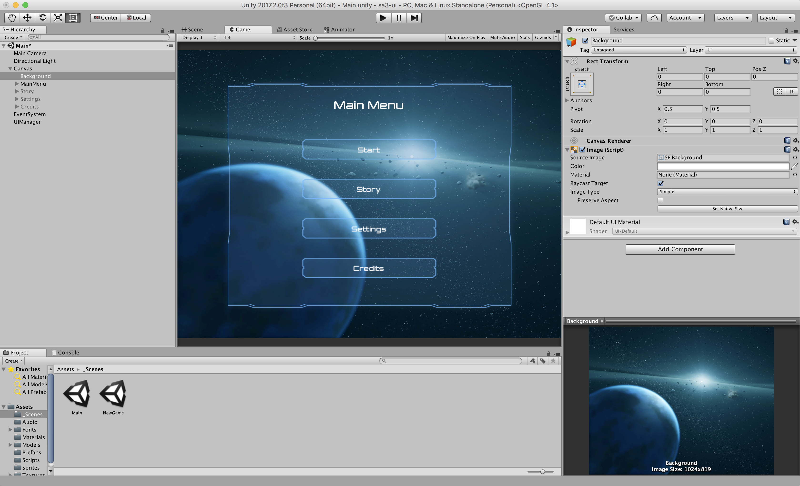
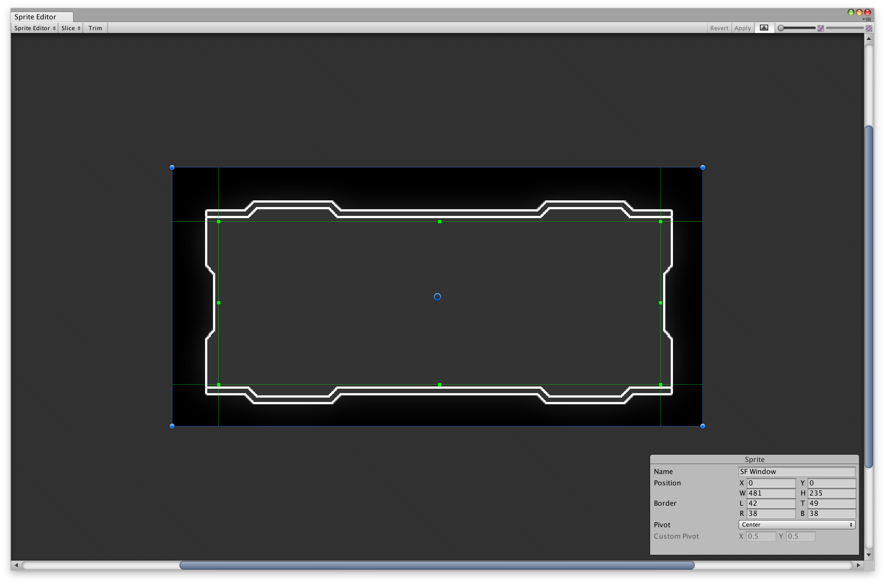
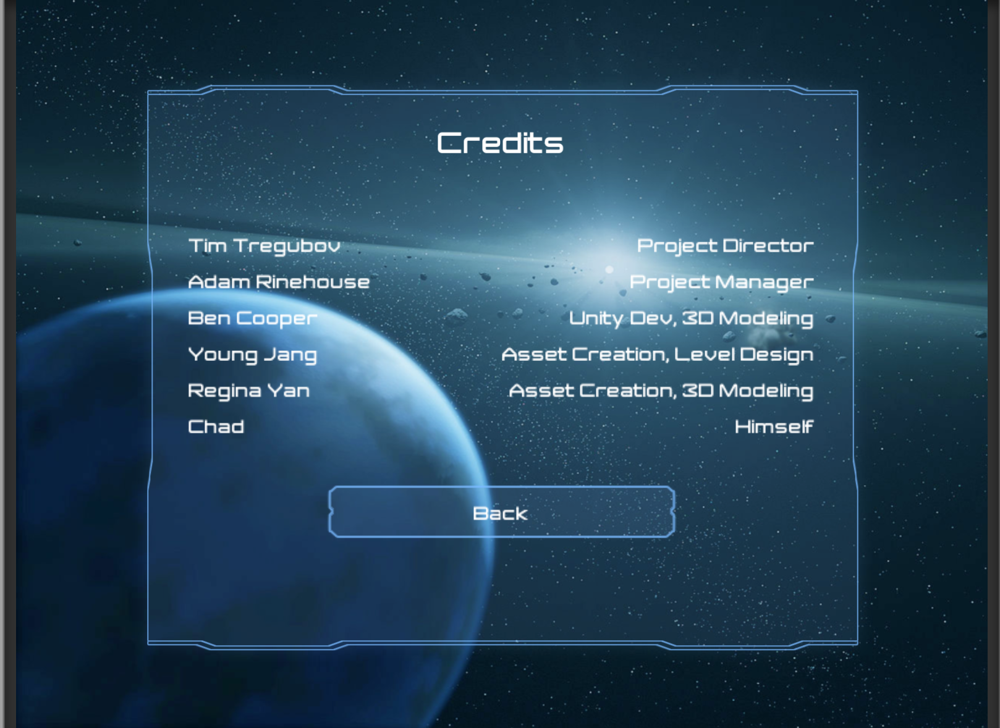

# Space Adventure Main Menu

Welcome! In this assignment, we'll be working with Unity's UI to create a Main Menu for a space adventure game. (Actually, you can make any themed game you want, but the provided skins are very spacey.)

Here's what my menu looked like at the end:



But of course, feel free to be creative! This assignment will be a little more hands-off than the last few shorts, so there's lots of room to experiment and add your own signature.

Ultimately, we want to make the following:

- Some background photo, to cover up the default skybox.
- A main menu screen, with links to other menus
  - Also includes a start button, to link to another scene
- A story screen (or something with some basic text on it)
- A settings screen, with sliders
- A credits screen, with two columns of content

We'll walk through the basics of UI by creating the first of these, the main menu.

## Getting Started
First things first, you'll want to download our asset starterpack, which you can find [here](https://github.com/dali-lab/cs66-sa3-ui).

Once that's done, open up the project in Unity and go to the scene called `Main` (which is empty).

Once there, we're ready to get started. Add a new `Image` GameObject (Create > UI > Image), and set the background image to `SF background` from the Theme folder (or whatever image you like!).

You'll have to resize the UI element. The easiest way is to set the Rect Transform's anchor presets to "stretch" for both horizontal and vertical, then setting all of the transform's variables to 0, which makes them have a distance of 0 from the edge of the frame. Here's a gif, in lieu of a deeper explanation:


Alright, we're ready for the first menu!

## Main Menu
Let's create a main menu. To start, create a new UI Panel GameObject (Create > UI > Panel). Rename it something like "MainMenu".

In the `Theme/SF UI` folder that was provided in the starterpack, you'll find a few skins for UI objects, one of which is called `SF Window`. Click on it, and open the sprite editor from the inspector. Recall 9-splicing from the last short assignment. This is most commponly used on frames like this one. 9-splice the frame so the inner square lies just inside the edges of the frame, like this:



Now it's ready for the scene!

The panel you just created has a component called "Image", which itself has a component named "Source Image". Drag `SF Window` onto the "Source Image" property. The frame for the panel will be replaced with SF Window. It's nice, but we should change the color to fit the background better. Select the "Color" property just under "Source Image" and pick one that you like.

Great, now let's make sure we can create more frames like this one! Save the panel as a prefab, and call it something descriptive, like "MenuPanel".

### Text and Buttons
The next step is to add the menu's content. Add a UI `Text` GameObject and a UI `Button` GameObject, and make them both children of the MainMenu panel you just created.

Set the text to something nice and descriptive, like "Main Menu". We've also provided a nice font, called Jupiter, which you can assign by dragging it onto the "Font" property of the text from `Fonts/Jupiter/Jupiter`. Resize the font (adjusting the width and height of the text element as needed) as you wish, and change the color so it's readable.

For the button, we want to combine all our knowledge from this short assignment so far. The button, by default, has a child GameObject called Text. Change its font to Jupiter, resize and recolor it, and make the text say "Start". For the button itself, we've included another skin in the starterpack called `SF Button`. 9-splice it in the sprite editor, and reskin the button to use this skin.

We'll be duplicating the button a lot, so save it as a prefab as well, and call it something descriptive.

Now, we need three more buttons! Duplicate it with the hotkey `cmd+d` (`ctrl+D` on Windows). Then rename the three new buttons to have the names "Story", "Settings", and "Credits", respectively.

### Layout
By this point you've probably noticed that all of our elements are sadly stacked on top of each other, and are impossible to read. One solution is to manually drag them so that they form a nice layout, but it's nearly impossible to achieve uniform spacing this way.

Instead, Unity has provided us with a nice builtin component, called "Vertical Layout Group". Select the MenuPanel prefab, and add this component to it. Already, things will have shifted around. We can add some more constraints to make things look a little nicer.

To start, under the "Child Alignment" dropdown, select "Middle Center". This will align the layout group to the middle and center of the UI Panel, which already looks far better. You can also play around with values for "Spacing", as well as "Top" and "Bottom" under "Padding".

Once you're satisfied, consider this main menu done for now! We'll come back and add links later.

## Other Menus
Now that we have this main menu panel done, it's pretty easy to make some other menus as well. You can duplicate the entire menu, and then change, add, and/or delete child GameObjects as needed. When you're editing one menu, just set the other menus inactive so you only see one at a time (you can do this by selecting a panel in the hierarchy view, and unchecking the box at the top left of the inspector).


Make three other menus to correspond to our three buttons (besides start, which transitions to another scene.) These are:

- Story, which should contain a title (UI Text, which says "Story") and a basic UI Text paragraph. Make up some background story about your game.
- Settings, which should contain a title, and at least three settings. Definitely use something like "Master Volume" as one, and maybe something like "Text Size" too. If you're interested in [extra credit](#extra-credit), make them something you aren't afraid to implement!
- Credits, which should contain a title, and multiple text entries that will be spaced in a 2-column format. Here's an example of the formatting, based on the DALI team that worked on the framework for this class:



For the credits page, I recommend having a title (UI Text), and then an empty GameObject that has all of the text GameObjects as children. There's a special component that you can assign to the empty GameObject, called a "Grid Layout Group". If you set the "Start Axis" property to "Vertical" and the "Constraint" to "Fixed Columns Count" (with a value of 2), it'll make your life much easier.

All three of the menus should have a back button as well, to link back to the main menu.

Once you're all done with that, it's time to connect the menus together.

## Linking


To get all of the menus talking to each other, there's no better option than our trusty C# scripts. Create an empty GameObject at the top level of your hierarchy, and call it "UIManager". Then, attach a new script to it, and call the script, "UIController". Open the script for editing.

We won't need the `Start()` or `Update()` functions at all, so delete them. Instead, we're going to define 5 public functions to do all of our transitions. These will be extremely simple. When a button is pressed, we will set all panels to inactive, and then set the desired panel to active. Let's start with just these functions for now:

```csharp
using System.Collections;
using System.Collections.Generic;
using UnityEngine;

public class UIController : MonoBehaviour
{

    public GameObject mainMenu;
    public GameObject story;
    public GameObject settings;
    public GameObject credits;

    public void toMain()
    {
        SetAllInactive();
        mainMenu.SetActive(true);
    }

    public void toStory()
    {
        SetAllInactive();
        story.SetActive(true);
    }

    private void SetAllInactive()
    {
        mainMenu.SetActive(false);
        story.SetActive(false);
        settings.SetActive(false);
        credits.SetActive(false);
    }
}
```

Sweet! But they don't do anything yet. For that to happen, we have to assign OnClick() parameters to the buttons. Save the script and return to Unity.

On the MainMenu panel, select the button labeled "Story", and scroll down in the inspector until you find "OnClick()". Click the "+" icon, drag the UIManager GameObject onto the input field, and then in the right dropdown, select "UIController > toStory()".

Similarly, in the story panel, set the back button's OnClick() attribute to call the UIController.toMain() function.

Now that you've got the hang of it, add more public functions to navigate to the Settings and Credits panels, and set all of the rest of the buttons.

## The Start Button
It's the first thing we made, and we've been totally ignoring it! The start button will transition to our main game (which for now, is just another scene that we've provided, called "NewGame"). Open up build settings with `cmd+shift+B` (`ctrl+shift+B` on Windows). Click the button that says "Add Open Scenes". You should see "Main" appear, with the number 0 next to it, which is the scene's build index.

Now, also drag the "NewGame" scene from the "\_Scenes" folder into the build settings. It should appear below "Main", and have a build index of 1. If they're out of order, just drag them into the correct order.

Now head back to the UIController script. Recall from the last short assignment that we need to use the `UnityEngine.SceneManagement` module. At the top of the file, add `using UnityEngine.SceneManagement;`.

Then, add the following public function:

```csharp
public void transitionToNextScene()
{
    SceneManager.LoadScene(1);
}
```

This just loads up a scene by build index, which in this case corresponds to the "NewGame" scene. Assign the Start button to call this function in its "OnClick()" attribute, just like we did for the other functions.

Run the game! You should be able to navigate to your other panels and back to the main menu, and Start should take you to the other scene we've provided.

## And We Are Done!
Save everything and push to your git repo. If you don't have it already, make sure you include a .gitignore that contains the following:

```
/[Ll]ibrary/
/[Tt]emp/
/[Oo]bj/
/[Bb]uild/
/[Bb]uilds/
/Assets/AssetStoreTools*

# Visual Studio 2015 cache directory
/.vs/

# Autogenerated VS/MD/Consulo solution and project files
ExportedObj/
.consulo/
*.csproj
*.unityproj
*.sln
*.suo
*.tmp
*.user
*.userprefs
*.pidb
*.booproj
*.svd
*.pdb

# Unity3D generated meta files
*.pidb.meta

# Unity3D Generated File On Crash Reports
sysinfo.txt

# Builds
*.apk
*.unitypackage
```

(courtesy of [github](https://github.com/github/gitignore/blob/master/Unity.gitignore))

This gets rid of a bunch of reports, builds, folders, and other things we don't need to have saved, and can save a lot of headaches from cryptic merge conflicts.

## To Turn In
- link to your git repo for this project
- make sure the repo contains a short file README.md with the following
  - what you did
  - what worked/didn't work
  - any general comments/suggestions

## Extra Credit
We designed a settings page with sliders. One of those sliders was for "Master Volume". Research how to include audio in the game, and add it in. Then, have the slider affect the master volume of the audio output.

You can also have the sliders adjust different settings in real time, like text size.

There are lots of other options too, you aren't just confined to the settings page!
