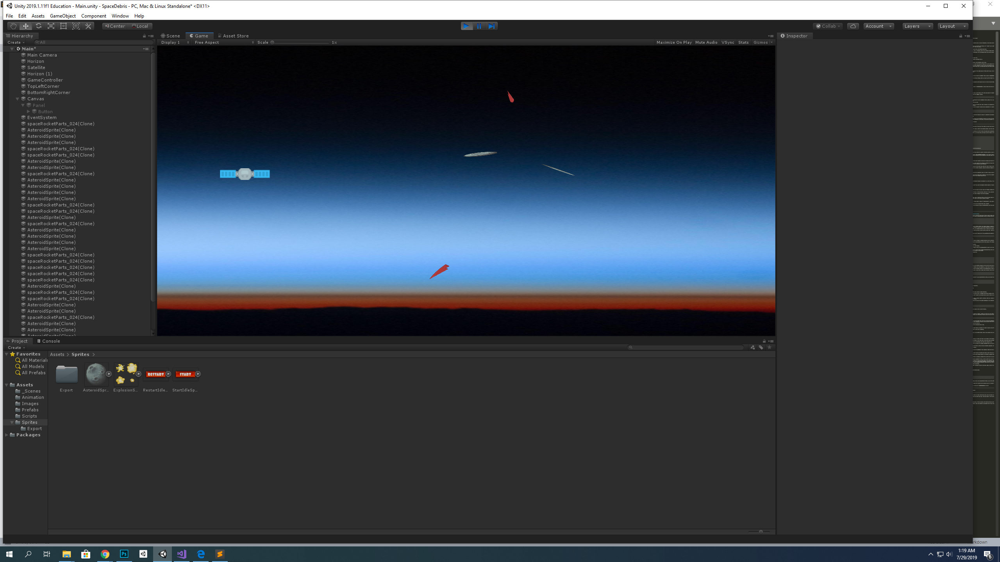
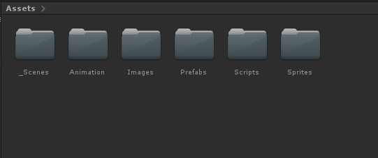
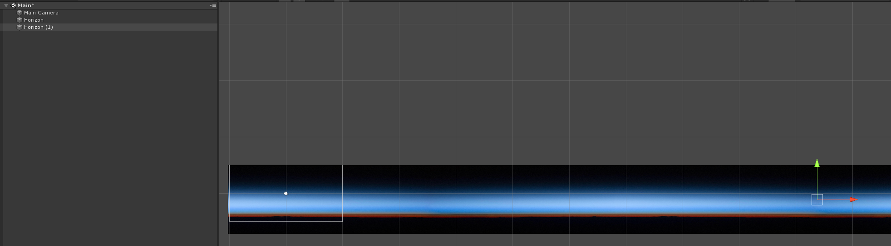
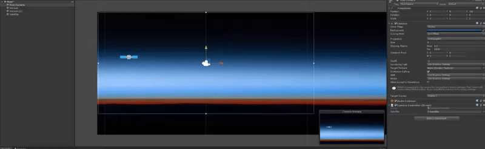
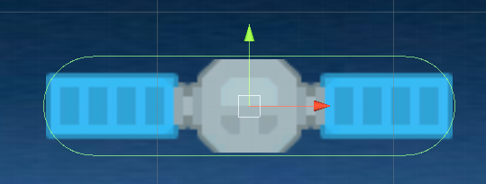

# Space Garbage



In this assignment, we'll be making a full game. It'll remind you of FlappyBird, but in space and a bit of added science.

To start, make a new Unity Project in 2D and open it.

## Objectives

* Understand 2D perspective
* Learn about sprites, collision detection, and basic physics
* Learn about UnityActions, both in scripts and in built-in UI elements like Buttons
* Use your knowledge to build a mini-game
* Extend and customize it to make it your own

## Getting Started
### Setting Up Our Assets Folder
We didn't really organize the Assets folder last time because we didn't have that much stuff. But as your projects grow in size and complexity, it gets more and more important to organize the Assets folder. Here's one way:



I'd recommend creating these folders now. It makes it easier to find things in the future, and to know where to put stuff in the future. The "\_Scenes" has an underscore in it by convention, so that the scenes folder always shows up first. You could do this for other folders if there's going to be a bunch of folders, and you know you're also going to want to find that folder very often.

### Importing Assets
We're going to get assets for this project from a couple different places. We'll get some from the Unity Asset Store, and download some others. 

We can start by finding assets in the Asset Store. If an Asset Store tab is available in the Unity Editor, open it. Otherwise, open it up by going to Window->Asset Store.

Once there, search for "2D Sprites Pack". It should be one of the first results, free, and made by Unity Technologies. Hit the download button, and when the window pops up on your screen to import the assets, select only the few that we'll need for the assignment:

- AsteroidSprite
- ExplosionSprite
- RestartIdleSprite
- StartIdleSprite

Hit import. Unity should automatically place these sprites in the `Sprites` folder that you created in the last step.

I've also found some open-source sprites for you to use online. You can download the Asset Package here. Unzip it and import everything from it.
[Download](assets/space_pack.unitypackage.gz)

### A Few Notes On 2D
This is the first time we're working in 2D, but don't worry! This should in theory simplify things by removing a whole dimension, and it does.

The only thing to really watch out for is that when creating any physics components, we want to make sure we select them from the "Physics 2D", as the normal 3D versions might cause some problems that we don't want.

Also note that our camera works a little differently here. If you look in the camera's inspector, under the Camera component, you can see that the projection field is labeled "Orthographic". In the picture below, you can sort of see the difference. Essentially, an orthographic camera sees objects at a seemingly equal distance regardless of their distance from the camera itself (i.e. a box 300 pixels away will look the same size as a box 3 million pixels away.) In 3D we are used to the perspective camera, which makes things looks smaller as they get further and further away, as they do in our, 3D, vision.


## Background
Our background is going to be a picture of the horizon. From the `Sprites` folder, drag the Horizon so that most of the camera space is filled with the sky. You can scale these out quite a bit, and then you can duplicate them with `command+d` on Mac or `control+d` on Windows, and then move the duplicate forwards to drag them out further. Mine looked something like this:



## The Satellite
Now that we've created some pretty cool space (around 2.7 Kelvin, actually), we need to put our satellite into it! From the `Sprites` folder, drag the `spaceStation_022` into the scene, and place it in the middle-left of the sky. Change its name to "Satellite" in the hierarchy view.

The satellite needs to be able to move semi-realistically, and hit things, which are usually considered to be Physics things. What do we need to add for this? If you guessed `Rigidbody`, you're close. Click "Add Component", and then click "Physics 2D" > "Rigidbody 2D".

Press the play button to test.

The satellite's falling down! That's not very realistic. Fortunately, we can just turn off gravity for the satellite (we're going to have to do this for most things here, because most of our objects are going to be orbiting in space!)

Go to the Rigidbody 2D component on the satellite, and set the Gravity Scale to 0.

Still, you're not actually able to control the satellite in any way, which is quite sad. Let's fix that.

In your Assets view on the bottom of the screen, navigate to Scripts, and Right-Click->Create->C# Script. Name it `PlayerController`. Drag and drop that onto your Satellite.

Double click on the Script to edit it. Copy and paste the following in--

```csharp
using UnityEngine;

public class PlayerController : MonoBehaviour
{

    public float stabilizerForce = 5.0f;
    private Rigidbody2D rb2d;
    void Start()
    {
        rb2d = gameObject.GetComponent<Rigidbody2D>();
    }

    void Update()
    {
        if (Input.GetKeyDown(KeyCode.DownArrow))
        {
            rb2d.AddForce(new Vector2(0, -1 * stabilizerForce * 10));
        }
        if (Input.GetKeyDown(KeyCode.UpArrow))
        {
            rb2d.AddForce(new Vector2(0, 1 * stabilizerForce * 10));
        }
    }
}
```

What’s going on here? We create a public float called stabilizerForce. That has a default value, but can be edited in the editor. We also have a Rigidbody2D component that we initialize to point to the Rigidbody2D on the player object. (Recall that this script is attached to the Player GameObject. The gameObject.getComponent call will therefore get the component of the specified type that is also attached to this player GameObject.)

In Update(), we are just listening for any time the user hits the up or down arrow buttons. When this happens, we add forces either up or down, depending on the button pressed.

### Randomness

Now it kind of feels like we have a little too much control over the satellite's motion. Making things too easy can get boring. Let's create some amount of randomness in the satellite's motion. 

In the `PlayerController` script, create a new public float named randomness. Then, copy the lines below into the `Update` function. 

```csharp
float random = Random.Range(-1.0f, 1.0f);
rb2d.AddForce(new Vector2(0, random * randomness));
```

Here, we're using Unity's in-built Random class to get a random float between -1 and 1, and then, after multiplying it by our randomness factor, adding it as a new force every frame. The random forces usually won't add up to crazy high amounts, because upwards and downwards forces cancel out, and because `random` will be equally as likely to be positive as negative.

You can play around with the randomness and stabilizerForce values in the Editor to get to an experience that you like.

### Clamping Velocity
You might notice that if you hit one direction arrow multiple times in close succession, the satellite starts to go really fast. This is because we are applying essentially a constant force over time. Recall that F=ma. Since force and mass are remaining constant, acceleration also remains constant, and a constant acceleration results in an exponentially increasing velocity.

We like realistic physics, but they have their place, and games like this bird aren't it. We want to make sure the player's velocity stays consistently in a specific range, so we want to `clamp` any value to that range. In your `PlayerController.cs` script, add in a public float `maxVelocity`, and add the following lines to your `Update()` function:

```csharp
rb2d.velocity = new Vector2(
  rb2d.velocity.x,
  Mathf.Clamp (rb2d.velocity.y, -maxVelocity, maxVelocity)
);
```

This sets the velocity of the satellite in each frame to stay the same in the x direction but clamps the y direction between the values of -maxVelocity and maxVelocity.

In the editor, play around with the values again until you find something you like, and press play to test.

### Moving Right
The satellite is in orbit around the earth, so it needs to be moving to the right. Also, in the final game, there will be obstacles to avoid, so we want to be able to get to them. What's the best way to get this right-scroll behavior? The easiest is to just initialize the player character to have a constant rightbound velocity. (Recall that x and y velocities are independent of each other--if you have two bullets in a vacuum, you can drop one from ten feet up and fire another straight out of a gun from ten feet up and they'll hit the ground at the same time.)

In `PlayerController.cs`, add a public float called `scrollSpeed` and then add the following to the start function:

```csharp
rb2d.velocity = new Vector2 (scrollSpeed, 0);
```

In the editor, set the scrollSpeed to 4. Our satellite now moves, but if you Run it, you'll see that it just goes off the side of the Camera. We need to get the Camera to follow it.

## CameraController
There are a few ways that we can get the camera to follow our player. The quick-and-dirty way is to make the camera a child of the Satellite object. Since all children are spaced relative to their parents, the camera will move along with the player. Try it out! Drag the Main Camera in the hierarchy over the Satellite to make it a child of Satellite. Hit play!

It does follow the Satellite, but a little too well-- we don't want it to be jumping up and down in the y-direction. We can't do that with parent-child relationships, but we can do it with a script.

Move the Main Camera back to its own position in the hierarchy. Create a new Script named `CameraController` as we did last time, and drag it onto the Camera in the hierarchy. Open the script for editing.

Here's the code for the camera controller:

```csharp
using UnityEngine;

public class CameraController : MonoBehaviour {

    public GameObject satellite;

    private float offset;

	// Use this for initialization
	void Start () {
        offset = transform.position.x - satellite.transform.position.x;
	}

	// Update is called once per frame
	void Update () {
        transform.position = new Vector3(satellite.transform.position.x + offset, transform.position.y, transform.position.z);
	}
}
```

This gets the difference of the x coordinates between the satellite and camera on startup, and then in each frame updates the camera's transform position to move that offset in the x direction. This makes the camera appear fixed relative to the player, but only along the x-axis, which is just what we wanted.

Back in the editor, we're about to see one of the many cool things Unity can do. Recall that we set a variable `public GameObject satellite` in our script. Like any other public variable, we can set it in our editor. It wants a GameObject, and specifically we want it to point to our `Satellite` GameObject. With the Main Camera selected in the Inspector, simply drag the Satellite from the Hierarchy to the space next to Satellite in the Camera Controller script component. That was a lot of words. Here's a gif:



Couldn't be easier! Hit play and make sure it's working.

## Colliders
Physical interactions are super common in video games. When a ball hits a player's foot, for example, the ball should respond to the kick by flying away from the foot. Or, when a daring plumber head-butts an inquisitive brick, a coin should emerge from the top. Unity's method of dealing with these collisions is the aptly named Collider.

Colliders are just components of any GameObject, with the special property that if two colliders meet, they either should not be allowed to intersect into each other, or should trigger some other functionality. They'll need to be on all objects that we want this property for, so if we want the satellite to to stop dead when it hits the ground, then both the satellite and the ground will need colliders.

### Capsule Collider
From the Satellite object's inspector, select Add Component > Physics 2D > Capsule Collider 2D. With the mouse over the scene view, press the F key to focus on the player object.

We want the collider to fit as closely as possible to the outline of the satellite. In the inspector, under the collider component, change the Direction dropdown to "Horizontal". At the top of that panel, click the button next to "Edit Collider". Then drag the top and bottom of the collider until they wrap nicely around the satellite, like so:



### Box Collider
Now, do the same thing for the ground! Add a 2D box collider component to the horizon sprite just like we did for the satellite. Move it so that it lines up with the image of the ground at the bottom of the sprite. The bottom of the collider doesn't really matter as much as the top.

Press the play button to test. You'll see that if the satellite hits the ground, it stops moving side-to-side (we're still able to control it, but we'll do something about that in a bit), but there's nothing stopping it from flying off into the sky. Fortunately, we can add multiple Collider2Ds to objects! Add another Collider to the Horizon GameObect, and put the bottom of that Collider above the Sky

If you used multiple Horizon GameObjects and don't want to add Colliders to each, you can just
1. Delete all but one
2. Add the Collider to one of them and resize it
3. Re-duplicate and move the Horizons around

*Note that adding multiple colliders to GameObjects isn't always a good idea-- if we needed to be able to distinguish between the Colliders in a script here, it would be impossible to do so in the Script itself unless we used 2 different kinds of Colliders (eg we used a CapsuleCollider2D for the second Collider).*

### Triggers

There's a special behavior of colliders that we want to utilize here: a trigger. Triggers are used when we don't just want the standard collider behavior of bouncing off each other. We can set the ground and sky to be triggers so that when the satellite collides with it, it *triggers* some function like, say, triggering a GameOver Action.

To set this up, just check the box in both collider components labeled "Is Trigger".

### Tags
One other thing, before we get back to code. The trigger will need to be referenced somehow. The easiest way to do this is to add a tag to all trigger colliders that we consider obstacles. The ground is one, and space debris particles will be the others. A tag is just a special property of a GameObject used for identification.

For now, in the ground object's inspector, at the very top, click the dropdown labeled "Tag", and select "Add New". At this new menu, click the "+" icon, and enter "Obstacle".

NOTE: You just created the tag, but you still have to apply it. Go back to the ground object's inspector and select "Obstacle" from the Tag dropdown.

Okay, now we're ready! Back to the codes.

## Game Controller
So we have a moving satellite, and we have some bounds from it. But it still doesn't really feel like a game. Once we really get into it, it'll be really useful to be able to keep track of high-level game stuff all in one, `GameController`, script. This script could theoretically keep track of scores, whether the game is running, what Sprites are being rendered, and, later on, will help us restart the game.

We'll go through this one step at a time.

First, create a new Empty GameObject in the scene. To do that, above the hierarchy view, select "Create" > "Create Empty". Rename it "GameController". Then create a `GameController` script and add it to the GameController GameObject. Open the script for editing.

### Triggering Game Over -- Actions!
There's a couple ways we could create something to keep track of the Game Ending. One of the cleaner ways is to use an in-built Unity class- Actions! 

As the name might suggest, actions can be used to keep track of specific things happening. In this case, we can declare an Action in GameController, have the action trigger when the satellite hits something, and have that action trigger multiple different functions, like pulling up a Restart screen, triggering some sprite changes, etc.

Include `using UnityEngine.Events;` in your `using` directives at the top of the file

Paste the following line of code into your `GameController` class:

```csharp
public static UnityAction gameOverAction;
```

If you want to learn more about UnityActions go [here](https://docs.unity3d.com/ScriptReference/Events.UnityAction.html).

We made the gameOverAction `static` because we only ever need that one Action per game, and, more importantly, to make the action easy to find in other scripts. Why is that important? Because the collider that isn't a trigger is attached to the player. That means when it meets with a trigger collider, the functionality for this is dealt with by the Satellite GameObject. Open the PlayerController script for editing, and add in the following function:

```csharp
private void OnTriggerEnter2D(Collider2D collision)
{
	if (collision.CompareTag("Obstacle"))
	{
		Debug.Log ("Died");
		GameController.gameOverAction.Invoke();
	}
}
```

This is a special function that is called when the GameObject that this script is attached to intersects with a trigger collider. The trigger collider is passed to the function as `collision`. We then check `collision`'s tag, and if it is an obstacle, we `Invoke` the gameOverAction. `Invoke` is a special function for Actions which is basically like pressing a button- Invoking an Action is what causes everything set to the Action to happen. Of course, we don't have anything set right now, but we will soon.

Note the use of `Debug.Log`. This is Unity's print function, and it sends output straight to Unity's console. I'd recommend getting to know it pretty well, because it might save you quite a few times down the road.

If you hit play, you should print "Died" to the console when your satellite touches the ground or ceiling. You'll also see a scary red error. Never fear-- that's just because we haven't actually set anything for the Action to do-- Unity is complaining because we're pressing a button that does nothing.

### Changing Sprites
Sprites are actually pretty easy to deal with in Unity. We have two Sprites saved in our sprite folder that we want to make use of: the spaceStation_022 (default) and ExplosionSprite. Add some more variables to your `PlayerController`:

```csharp
public Sprite normalSprite;
public Sprite explodeSprite;
```

In the inspector, drag the spaceStation_022 onto normalSprite, and the ExplosionSprite onto explodeSprite.

You might notice that the ExplosionSprite has 4 different explosions inside it. It'd be really nice if we could go through an animated explosion when the satellite hits something. 

We could go in and create an animation ourselves. Or, of course, we could just let Unity do it for us! Drag the ExplosionSprite into the Scene window. It'll automatically create an Animation file and an Animator Controller file in the Sprites folder. Move these files to the Animation folder. 

We'll go over what those mean in more detail in a further assignment (or you could look it up online of course!). 

The GameObject for the Explosion will have an Animator as well as the Sprite Renderer that's also on all our other Sprites.

You'll see that the explosion is huge compared to our satellite. That's an easy fix, though! In the Asset Window, click on the ExplosionSprite to open it up in the Inspector, and set the Pixels Per Unit to 1000. You can now delete the Explosion GameObject from the Scene!

We need to add an Animator Component onto our Satellite GameObject so that once it explodes, we can animate it. Drag the newly created AnimationController (the icon will look like a flowchart in the Asset window) into the `Controller` field of the Animator. Turn off the check mark for the Animator Component, as we don't want this to always run-- we'll turn it on when we change out the Sprites!

Last thing-- open the Animation clip in the Inspector and turn off Loop Time, so that the explosion only plays once.

Ok. We're done with all that setup. Back to coding!

Open the PlayerControllerScript and add in the following lines of code-

```csharp
private void Explode()
{
	SpriteRenderer spriteRenderer = gameObject.GetComponent<SpriteRenderer>();
	spriteRenderer.sprite = explodeSprite;

	Animator anim = gameObject.GetComponent<Animator>();
	anim.enabled = true;
}
```

Here, we've created a function that, when called, will change out the Sprite on this GameObject, and start up the animation sequence. But how will this ever get called?

We want this function called when the satellite hits something. Fortunately, we've created an Action that triggers when this happens! So, we just need to add this function to that Action.

In the PlayerControllerScript, add `GameController.gameOverAction += Explode` to the Start function. This adds the Explode function to the gameOverAction so that when that Action is triggered, that function is.

When using Actions, we need to be careful that every time we add functions to an Action, we should usually have a place that we remove those functions from the Action as well. So, add the following lines of code to your PlayerController script--

```csharp
private void OnDestroy()
{
	GameController.gameOverAction -= Explode;
}
```

It might also be good to disable player control once the satellite is hit. To do that, add the following function to your playerController Script, and add that function to the GameOverAction just like we added `Explode` (make sure to also remove the function in `OnDestroy`.

```csharp
private void StopMotion() {
	rb2d.velocity = new Vector2(0.0f,0.0f);
	stabilizerForce = 0.0f;
	randomness = 0.0f;
}
```

Now, when the gameOverAction is triggered, we'll stop the satellite in its tracks, and make further motion impossible.

## Space Debris
Alright, it's time we add some obstacles. We have a couple different sprites for possible pieces of debris-
- spaceRocketParts_024
- spaceRocketParts_026
- AsteroidSprite

We'll do something in the GameController that will automatically randomly place obstacles in the satellite's path, moving in random directions.

Place each of the above 3 sprites in the Scene view. Add Colliders to each of these, and edit them to fit as best you can. I recommend using Circle Collider 2D for the Asteroid and Polygon Collider 2D for the Rocket Parts. Tag each of them with the "Obstacle" tag.

We also want to be able to move each of these components well, so let's add Rigidbody2D's to each of them. Don't forget to set Gravity Scale on each of them to 0 so that they don't fall to the ground.


## Prefabs
We want more than just 3 obstacles, but we don't want to create a ton of things in the inspector again and again. Luckily, there's a shortcut. Unity has a notion of *prefabs*, short for prefabrications. They allow you to store a template for a GameObject so you can instantiate the same thing over and over again. They have some bonus features too, which we'll see in a moment.

Drag the three debris GameObjects from your hierarchy over to your Prefabs folder in the Project Files. Notice that each of the debris GameObjects in the hierarchy have turned blue, to indicate that those GameObjects are prefabs. You can now remove the GameObjects from the scene.

### Auto-instantiation of prefabs
Add the following lines to the GameController script-
```csharp
public GameObject debris_1;
public GameObject debris_2;
public GameObject debris_3;
```

Back in the Editor, open the GameController GameObject in the inspector, and drag in the 3 prefabs you just created to the 3 slots for Debris.

Now we just need to figure out a good way to randomly get these pieces of debris into the scene. 

One way to do this is to just drop a bunch of objects into the scene within certain bounds. 

Go back to the Editor and create an empty GameObject. Move it to the top left of the area where you'd want objects to appear-- ideally, near the top of the camera view, and somewhat to the right of where the satellite starts. Name this gameObject "TopLeftCorner". Duplicate this empty Object and move it to the bottom right corner where you'd want objects to appear-- ideally, near the bottom of the sky, and all the way to the right of where you've dragged out your Horizon sprites. Rename this one "BottomRightCorner".

Back in the GameController script, add the following lines-
```csharp
public Transform topLeft;
public Transform bottomRight;
```

Back in the editor, move the TopLeftCorner gameObject to the Top Left field, and the BottomRightCorner to the Bottom Right field. We're just using these GameObjects for their position, so the only component we need from them is their Transforms. Unity is smart enough that when you drag an entire GameObject into a Component's space, it finds the correct Component on that GameObject (if there is one), and puts that into the field.

Add in a public int `debrisCount` to the GameController so we can change how many pieces of debris there will be on the fly

Now we want to auto-populate the space with debris. In the Start function of the GameController script, add the following lines of code-
```csharp
float left = topLeft.position.x;
float right = bottomRight.position.x;
float top = topLeft.position.y;
float bottom = bottomRight.position.y;
for (int i = 0; i < debrisCount; i++)
{
    Vector3 randomPos = new Vector3(Random.Range(left, right), Random.Range(bottom, top), 0.0f);
    Vector2 randomVel = new Vector2(Random.Range(-1.0f, 1.0f), Random.Range(-1.0f, 1.0f));
    int randomInt = Random.Range(0, 2);

    GameObject randomObj;
    if (randomInt == 0) randomObj = debris_1;
    else if (randomInt == 1) randomObj = debris_2;
    else randomObj = debris_3;

    GameObject placedObj = Instantiate(randomObj, randomPos, Random.rotation);
    placedObj.GetComponent<Rigidbody2D>().velocity = randomVel;
}
```

### Updating a Prefab
Run the game! There should be a ton of obstacles that appear. You can increase the debrisCount to make the game harder, or decrease it to make it easier. But you'll notice that when you hit stuff, nothing happens!

What's going on? The satellite just crashes into our debris. It's almost like that OnTriggerEnter2D function we wrote isn't triggering.

Wait...

We forgot to check Is Trigger for all of our debris prefabs! Luckily, it's really easy to edit all of those. In the prefabs folder, click on your prefabs one by one, and in the inspector, set Is Trigger to true. This automatically applies to all instantiated prefabs.

Should be working now, check it out!

## UI
I'm as amazed as you are, but no we still aren't done. Don't worry, we're almost there!

We want to add some UI panels, so we can start and restart in-game, without having to restart the entire process. To start, let's add a new UI Panel to the hierarchy. Select "Create" > "UI" > "Panel".

Wow, looks like we got more than we bargained for. The UI panel is massive, and only the bottom left corner appears in our scene view. We also have three new GameObjects, instead of just one: "Canvas", "Panel" (the one we wanted), and "EventSystem".

All UI elements need to be children of the Canvas GameObject, so Unity created one for us. They all also need an EventSystem, which Unity also created for us.

The cool thing about the canvas is that it doesn't render like the rest of the gameobjects in the scene. It's an overlay. It's highly recommended that you do all of the editing in the Game View instead of the Scene View like normal. That way, you can see how the panel will ultimately look in the Game.

Once you're in the Game View, go to the inspector for the panel. Set the Left and Right to 150 and the Top and Bottom to 100 (in the Rect Transform component). Set the background to some pretty color, up to you.

This panel is going to be our Start screen (you can rename it that if you'd like). We need some text and a button.

### Text
We can add a Text UI object as a child of the Panel. Right-click on the panel and select UI > Text. In the new text GameObject's Text component, change the text in the text box to say something like "SpaceAdventure v 1.0". Move the transform up in the y direction about 50 pixels or so.

### Button
Next, add a button in the same way we just added the text. Delete the button's child object, called Text. (Don't delete the sibling text object, that's the one we just made!)

Now, you can attach the StartIdleSprite button sprite to the Button's Image component. Drag the sprite onto the Source Image property in the button's inspector (which should currently have something like "UI Sprite" in it). Resize the Rect Transform component until it looks nice, and move it down so it's balanced in the panel.

Fun fact, Buttons make use of the same system as UnityActions- I wasn't making stuff up when I compared Actions to pressing a button! We'll use this fact to our advantage ahead.

### Scene Changes
Now that we have a specific button to start the game, let's make some edits to our scene. Disable the Satellite GameObject for now, so that we don't see it and it doesn't move until we press the Start button.

We can add in functions to the button just like we did for our UnityActions. But we don't even need to do that! If you open the Start button in the inspector, under the Button component, you'll see a rectangle labelled "On Click()". The rectangle will just say "List is Empty" for now. Press the plus button on the bottom right of the rectangle. There'll be a new field. Drag in the Satellite GameObject. Click the "No Function" box. From here you can access any and all public functions associated with the scripts on this object, and run them when the button is pressed. Right now we're using an in-built function- in the popup, choose GameObject->SetActive. Make sure that the check box is checked. 

This now means that when this button is pressed, the Satellite Object will show up and the scripts will start functioning.

We also want to turn off the panel when this button is pressed. So, let's add another slot in the "OnClick()" rectangle and drag in the panel. Again, click the "No Function" box, and choose GameObject->SetActive. For this one, though, make sure that the check box is unchecked. This will make the panel invisible, and remove its functionality.

Click play. The satellite should disappear, but reappear when you hit the "Start" button!

## Restart Panel
Now we're getting somewhere. But we still need a restart panel. Duplicate the start panel so we have a good starting point.

A few things to change.
- The text. Change it to something like. "You died! Restart?"
- The button. Change the sprite to the `RestartIdleSprite` sprite.

Open your GameController script, and add the following function--
```csharp
public void Restart()
{
	//Add stuff here later!
}
```

Now we can change out what the OnClick for the restart button will do! Remove one of the slots. For the other, drag in your GameController Object, and set the method to GameController->Restart.

## Reloading the Scene
Alright, that should all be wired up. Now we just need to add the functionality for `ReloadScene()`. What should this function do? We basically want it to restart the game, and we aren't really persisting anything, so there's no shame in just restarting the entire scene from scratch.

How do we do this? Unity has a `SceneManager` builtin class. To use it, you'll need to import its package. At the top of `GameController.cs`, add in

```csharp
using UnityEngine.SceneManagement;
```

Now that it's imported, we can use its most popular function. Add in this line inside the `Restart()` function:

```csharp
SceneManager.LoadScene(0);
```

What does this do? It will load scene 0. The 0 refers to the build index of the scene to be loaded. To set that to be this current main scene, save the script and return to Unity.

Once there, select File > Build Settings. This will open a new window. Directly below that upper panel, click the button that says, "Add Open Scenes". You'll notice that "Main" appears (if it wasn't there already) with a "0" next to it. This is its build index. As we build larger and larger games, we'll soon see this fill up with larger numbers of scenes.

That's it! Save the scene, press play, and you can play FlappyBird as much as you want now.


## And We Are Done!
Congratulations! You grappled with a lot of stuff in this short assignment, but hopefully it all makes some sense. At the very least, you've built what may be your very first game, and it's a pretty fun one!

If you'd like to export the game as a standalone, you can go back to the build settings menu and click "Build". Unity will generate an executable file for you (`.app` on Mac, `.exe` on Windows), and save it to the folder that this project is in. You can open it and run independently without Unity!

Push this project up to your GitHub repo and write a short README describing how it went (details below).


## To Turn In
- Link to your Github repository, submitted to Canvas
- The repo should contain a short file `README.md` with three sections
	- What you did
	- What worked/didn't work
	- Any general comments/suggestions


## Extra Credit
There are lots of opportunities for extra credit here. Get creative!

- Keep score for how long the player stays alive
- Keep a high score and persist it through scene reloading
	- This is a little more challenging. You might want to look into ScriptableObjects
- Create some different 2D assets and replace the current ones with them.
- Make the game harder as it goes on
- Make the debris pieces bounce around the bounds so they don't just escape
- Anything else you might want to try, if it seems like a worthy extension!
