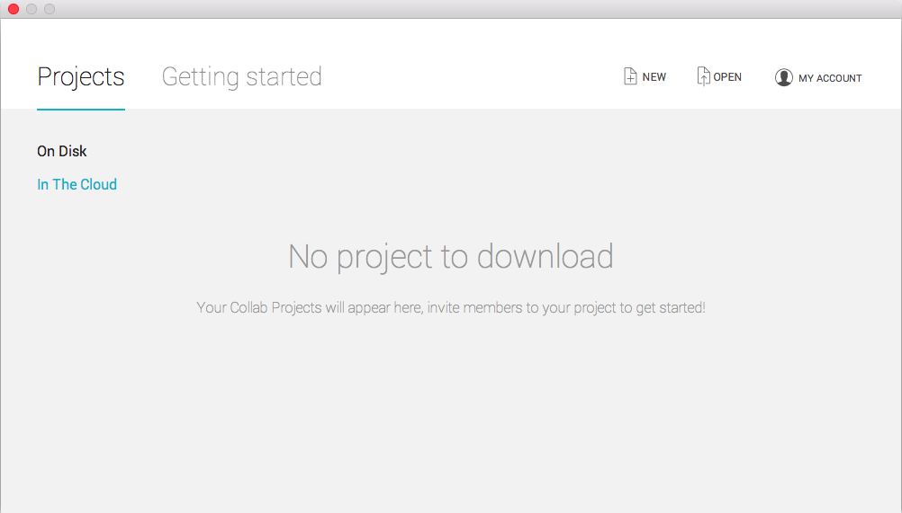
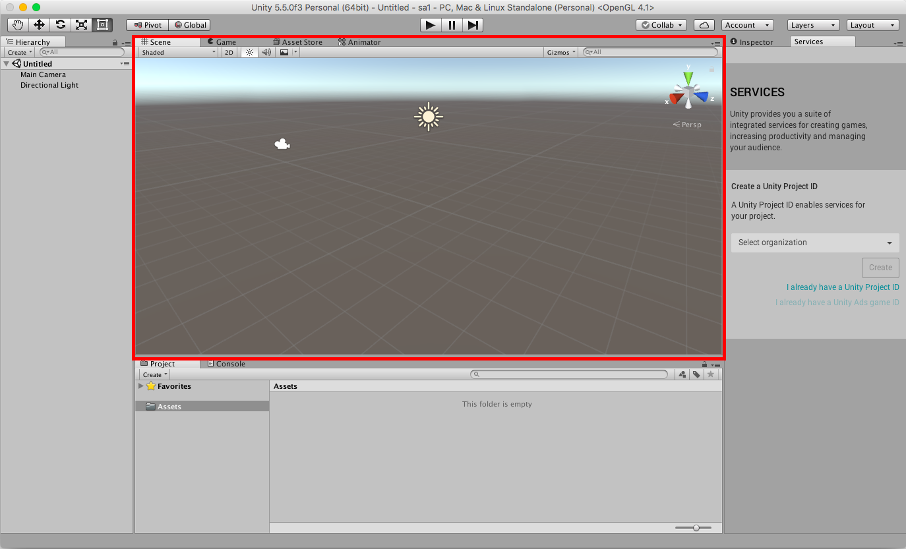
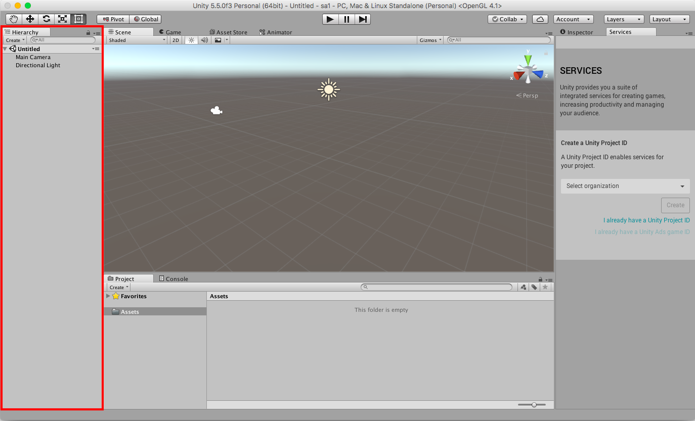
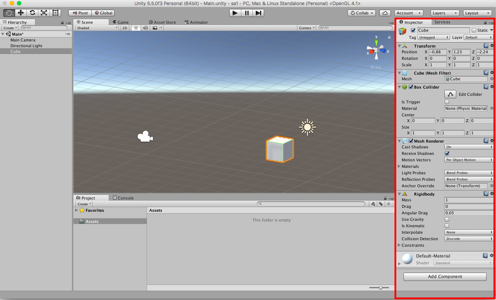
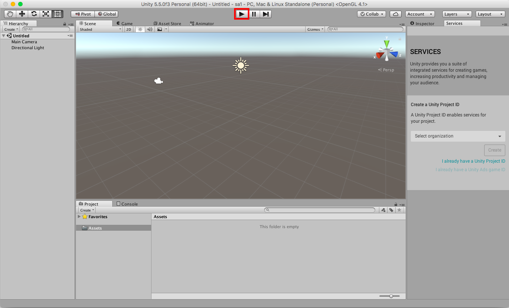
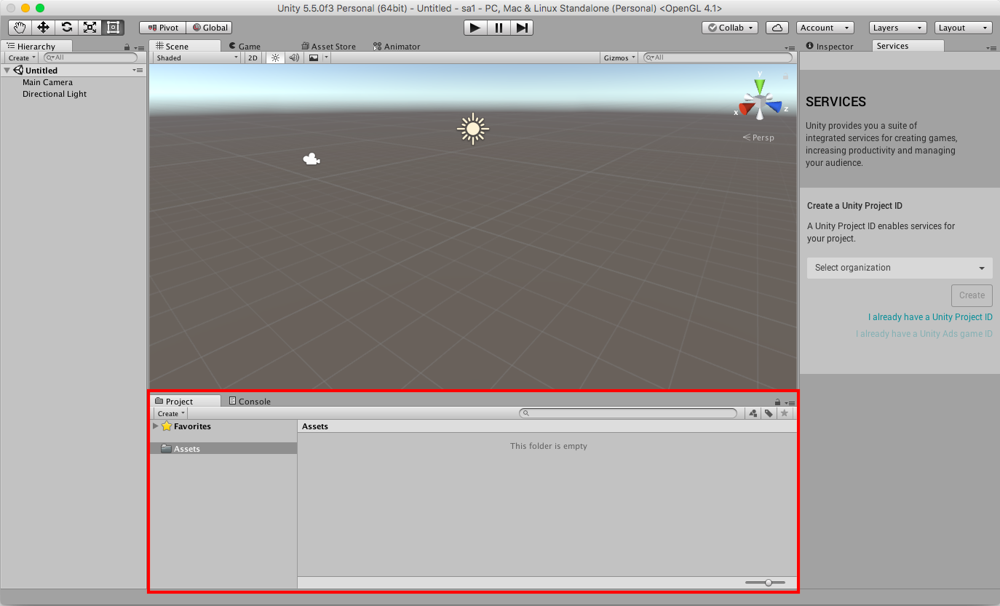
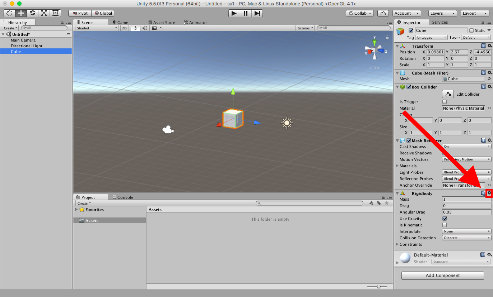
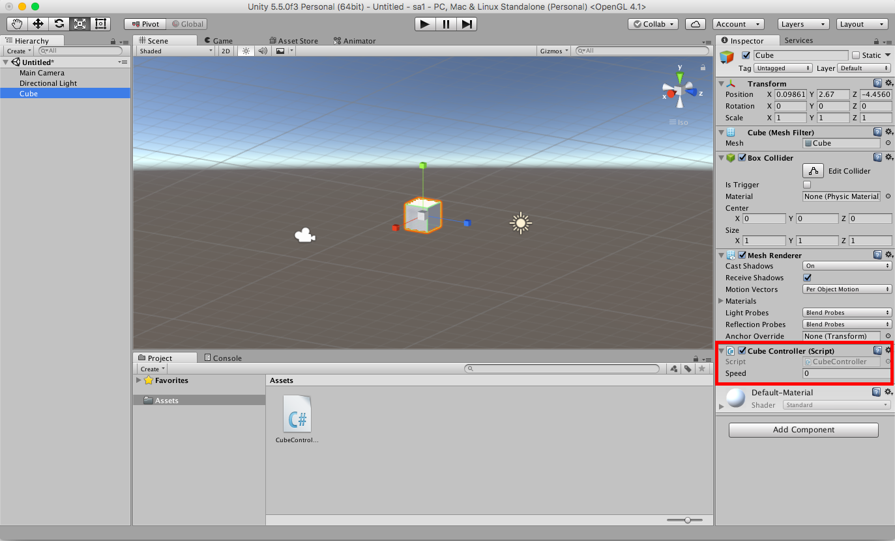

# Up and Running with Unity

It's hard to take a class on game development without an environment to develop games in. Enter Unity. In your first short assignment, we'll be walking through the ins and outs of the Unity editor to get you up to speed on all of its basic features.

This list is not at all exhaustive! There's plenty to explore in the upcoming weeks, and you'll be doing a lot of it yourself. But, by the end of this assignment, hopefully you'll start to feel comfortable enough that experimenting will be easier.

## Unity


🚀 Install [Unity](https://unity3d.com/get-unity/download). The Personal Edition is more than enough for this class. Unity is a game engine that was designed to democratize game development. It's super easy to learn and extremely powerful. We'll be using Unity for all of our development, except for script writing.

🚀 Install [Visual Studio](https://www.visualstudio.com/downloads/). The Community Edition is fine. Visual Studio is a nice IDE that recently became available for Mac users in addition to the standard Windows userbase. It's a great IDE for C#, which is the language we'll be writing all of our scripts in.

🚀 Install [GitHub Desktop](https://desktop.github.com/). We will be mostly using `git` from the commandline but installing the app gives us a nice git tree visualization.

## Command Line

We’ll be doing a lot of commandline stuff. We’ll introduce stuff as we go, so do not fear, commandline is best.

If you are interested here’s a tutorial that gives you more than enough to be a master: [learn just enough commandline to be dangerous](https://www.learnenough.com/command-line-tutorial).

Before you open your default Terminal, you should download [iTerm2](https://www.iterm2.com/downloads.html). It’s completely open-source, and it’s vastly superior to the default terminal.

You should also download a git command prompt to make life easier when we work with git later on. You can find a cool one [here](https://github.com/jimeh/git-aware-prompt). Follow the instructions on the README at that link to install it!

Here’s some commandline basics:

* ls -la will list files in current directory
* pwd will show current directory
* cd somedirectory will change directory to somedirectory
* cp source target will copy files
* mv source target will move
* rm somefile will remove that file (permanently, bypassing trash)
* mkdir somedirectory will create a folder (directory)

On OSX:

* open somefile will open the file in the default app associated with it
* open somedirectory will open that folder in Finder

## Let's Get Going!
After Unity is installed, go ahead and open it up. You'll most likely be seeing this screen:



We'll want to start up a new project, so hit "New" in the top right corner. On the next page, fill in all the information:
* Project name: sa1
* Location: wherever you want to save it. I picked Desktop.
* 3D/2D: choose 3D
* Enable Unity Analytics: off for now, we won't need it for this assignment

Click create project to get started!

## The Editor
Wow, this sure looks complicated! Not to worry, it'll all make sense soon. Here's some more detail on everything you're seeing:

### Scene View


That big screen in the middle is the Scene View. It's where you'll compile all the pieces together to produce the current scene (Unity's word for the current game stage is a "scene". A game can be made up of lots of scenes, each serving a different purpose. Some can be levels, some are main menu screens, some credits, and so on.)

You can navigate around the scene view in a couple of ways.
* Use the mouse's scroll wheel to zoom in and out. You can also zoom with the drag tool selected (top left, looks like a hand) by holding down the `ctrl` key.
* That drag tool is used to navigate sideways along the current view.
* You can rotate the view by clicking and dragging while holding the `alt`/`option` key.

### Hierarchy


The Hierarchy contains all of the GameObjects that are currently in place in the scene. You may notice that we already have two of these by default: Main Camera and Directional Light. You can see these in the scene view as well. The main camera is the perspective from which the player will see the game in the Game View, and the Directional Light is the global light raycaster for the scene, and will help determine directions of shadows, etc.

Let's create a new GameObject. At the very top of the hierarchy, open the "Create" dropdown, and select 3D Object > Cube. A new cube will appear at the center of wherever your camera is looking. Click on the cube to highlight it, then move your mouse into the scene view and press the "F" key to focus the scene view on the cube.

### The Inspector


Your new best friend, the inspector, allows us to view and change the attributes of individual game objects. By default, the inspector is already filled with a lot of default *components*. A component is a specialized thing attached to a GameObject. We don't need to know what all of the cube's default components do, but in their current configuration, we should know that they make this cube uniquely a cube and not, say, our Main Camera.

Right now, we should definitely know about the *transform* component. Simply put, it describes the current location in space of this GameObject. Play around with the numbers a bit so you get a sense of how they work.

Unity also has a nice feature for changing the numbers. To change the Y Position, for example, simply click on the "Y" next to the text field and drag up or down to change the value 🆒

### The Game View


Next to the tab that says "Scene" about the scene view, there's another tab that says "Game" with a little Pac-Man icon next to it. If you click that tab, your scene view will change into the Game View, which is the view you'll see when you're actually playing the game.

Recall from earlier that the game view is from the perspective of the Main Camera. So, if we move the camera's transform, what will happen? Try it out! Select "Main Camera" in the hierarchy and change the values of its transform in the Inspector.

:exclamation: What happens when you try to change the scale of the camera? Why do you think that is?

### The Play Button
Alright, navigate back to the scene view. Then, click the Play Button at the top of the editor.



You should now be seeing the game view again. It might look the same, but different things are happening now. The engine is now working its magic, running background methods like `Update()` and `FixedUpdate()`, optimizing for dynamic vs kinematic and static rigidbody physics, and lots of other things that don't make sense now but will in no time!

As a quick demonstration, let's add a component to our cube.

### Adding a Rigidbody
Click the Cube again in the Hierarchy. At the bottom of the Inspector, click the button labeled "Add Component". Then select Physics > Rigidbody. The component will appear in the inspector with all the defaults selected.

A rigidbody is a required component for Unity to invoke physics on this GameObject. You'll notice right away that the component has things we would associate with physics calculations: Mass, Drag, Gravity, etc. Leave these all be for now.

Navigate back to the Game View. Nothing has really changed, the cube is in the last place we left it. But what happens if we hit "Play" again..?

The cube falls out of view! Unity detected that the cube object has a rigidbody component attached to it. Since the default setting enables gravity, Unity applied a constant downward force of 9.8 m/s<sup>2</sup> on our cube. This is just a quick example of the power of the Unity engine, which will become more apparent as we go through this term.

### The Project View


The last important view for now is the Project View. This contains the directory tree for our current project, starting with the Assets folder, which is created by default. In a given project, you'll probably have folders for your prefabs, scenes, sprites, scripts, and materials. We'll cover each of those soon.

For now, we should save our scene in an aptly-named folder. Right click on the Assets folder and select Create > Folder. Rename this folder "\_Scenes".

Save the scene by clicking File > Save Scenes or by pressing the hotkey combination `command-s` on Mac or `control-s` on Windows. Call the Scene "Main" and save it in the \_Scenes folder.

### Some Basic Scripting
Now that we're all oriented with the views, it's time to get our feet wet with some basic scripting. Since we've already been playing around with it, let's add some control to our cube object.

One quick note: the we'll be directly moving our cube by affecting its transform, and not by using physics on its rigidbody. Since we won't be needing the rigidbody, you can go ahead and delete it. Inside the Rigidbody component, click on the gear, called the "Context-Sensitive Gear Menu," in the top right corner, and click "Remove Component".



How do we do that? Well, we're going to need to create a script and attach it to the cube. There are a couple of ways to do this. We could create the script in the project view and then add it in as a component to the script in the inspector, but that's a lot of clicking.

There's a better way! In the cube's inspector panel, click "Add Component" and scroll to the bottom of the list. There should be an option "New Script". Click on this, and you're given a few options. Let's name our script, "Cube Controller" and make sure the language is set to C Sharp.

*But I don't know any C!* That's totally fine. C# is an object-oriented version of C developed by Microsoft using the .NET framework. We'll see shortly that it's basically a better version of Java, with which I'm sure you're well-acquainted.

(As an aside, Unity allows us to code in three languages: C#, a Unity flavor of JavaScript called UnityScript, and Boo, which is similar to Python. C# is by far the most powerful and feature-rich, and Unity actually announced in August of 2017 that it would be deprecating support for UnityScript and Boo. For more information, check out their [blog post](https://blogs.unity3d.com/2017/08/11/unityscripts-long-ride-off-into-the-sunset/) on the announcement.)

After you click "Create and Add", Unity will both create the script and attach it as a component to the cube GameObject 🆒 Double-click on the "CubeController" script attribute to open the default IDE (either MonoDevelop on Linux/macOS or VisualStudio on Windows by default).

#### A Note On Linux
Some Linux users may have an issue opening MonoDevelop automatically. If this is the case, it may be because the script that launches MonoDevelop requires a program called `realpath`. Entering this command in your Terminal and trying again:

```sh
$ sudo apt-get install realpath
```

should do the trick.

## Our First Script
Now that we're in the editor, we can see that Unity has kindly provided us with some template code. It doesn't do anything yet, but we should be familiar with the two functions provided.

```csharp
// Use this for initialization
void Start () {

}
```

`Start()` is a method called at runtime when the program starts up. While you might define some class/instance variables before these methods, you should do all of your initialization in the `Start()` method, as you normally would do in a constructor.

```csharp
// Update is called once per frame
void Update () {

}
```

`Update()` is called at a certain stage of each frame, where it will execute code on GameObjects in the scene. This is particularly useful for making GameObjects react to user input, and it's where we'll be putting all of our code. Go ahead and delete the `Start()` function. We won't need it for now.

### A Responsive Cube
Alright, go ahead and replace the `Update()` function with the following code:
```csharp
void Update () {
  float horizontal = Input.GetAxis ("Horizontal") * Time.deltaTime;

  gameObject.transform.Translate (new Vector3(horizontal, 0, 0));
}
```
There's a lot of new vocab here, so let's go through it:
- `Input` is a class used to interface with Unity's input system. It's how we'll get all of our user input. It has some nice classes, like
- `Input.GetAxis(string)`: this returns the value of the axis of input defined by the string it takes as a parameter. So in our code, `"Horizontal"` means we are telling the method to get all of the user input pertaining to the horizontal axis. It will return some value based on whether or not the left or right arrow keys are being held down.
- `Time.deltaTime` returns the length of time in seconds it took for the last frame to execute. It makes our code frame-rate independent, so the results of running this code on different computers with different processors should be the same.
- `gameObject` refers to whichever gameObject this script is attached to. In this case, that's our cube.
- `transform.Translate()` will move, or translate, the cube by some unit of distance, described as a 3D vector which Unity calls a `Vector3`. Here we are creating a new `Vector3` that moves in the x direction only.

Save the script and return to Unity. Check the game view to make sure that the cube is in sight. Press play and try to move the cube left and right.

It works! But it's a little slow. Head back to the script editor to add some speed.

### Speeding It Up
There are a few ways to affect the speed. We could do something like:
```csharp
  float horizontal = Input.GetAxis ("Horizontal") * Time.deltaTime * 5;
}
```

but we don't want magic numbers in our code. We could make a variable...

```csharp
int speed;

void Start () {
  speed = 5;
}

void Update () {
  float horizontal = Input.GetAxis ("Horizontal") * Time.deltaTime * speed;

  gameObject.transform.Translate (new Vector3(horizontal, 0, 0));
}
```

but that's still bad! Every time we wanted to change the speed, we would have to go into the script editor and change it.

Unity does something nice for us. If we declare a variable as `public` in the script, it allows us to edit the value of it directly from the inspector! Make a `public int speed` instance variable (and don't initialize it anywhere!), and multiply the horizontal float value by it in `Update()`. Save the script and return to Unity.



Sweeeeet. But a 0 won't get us very far. Play around with the value and then hit the play button to test!

### Adding Vertical Control
This is nice and everything, but we can only go in one direction! See if you can add some functionality to also move the cube along a vertical path.

### And We Are Done!
Congratulations! You've explored the basics of the Unity Editor, and are ready to build your first game. We've explored:

* The Scene View, where you'll edit your scene
* The Hierarchy, where all of your scene's GameObjects are contained
* The Inspector, where you can view and edit the components attached to a GameObject
* The Game View, where you can see the game from the player's perspective
* The Play Button, where you can run the Unity engine on this scene
* The Project View, where you can view the project's directory tree and all its assets
* The default IDE and some rudimentary scripting in C#

### Extending the Script
There are lots of opportunities for extra credit here.

- Can you add a feature to rotate the cube if a different button is held down? (You might want to look up the `Input.getKey()` method.)
- What if we want to change the color of the cube when certain keys are pressed?
- What about scale?
- Anything else you can think of?


### To Turn In
- Compile all of your work into a git repo and push the code up to GitHub to a repo called `cs66-sa1-<YourGithubUsername>`
- Submit a link to your repo with some general comments:
  - What you did
  - What worked/didn't work
  - Any general comments/suggestions

That's it! Keep an eye out for the next short assignment, where we'll be building our first simple game!
