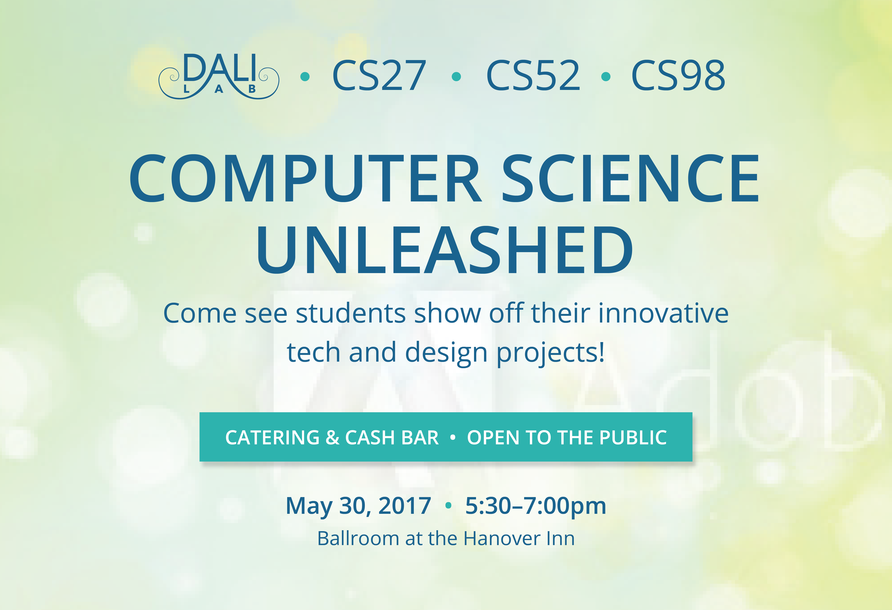
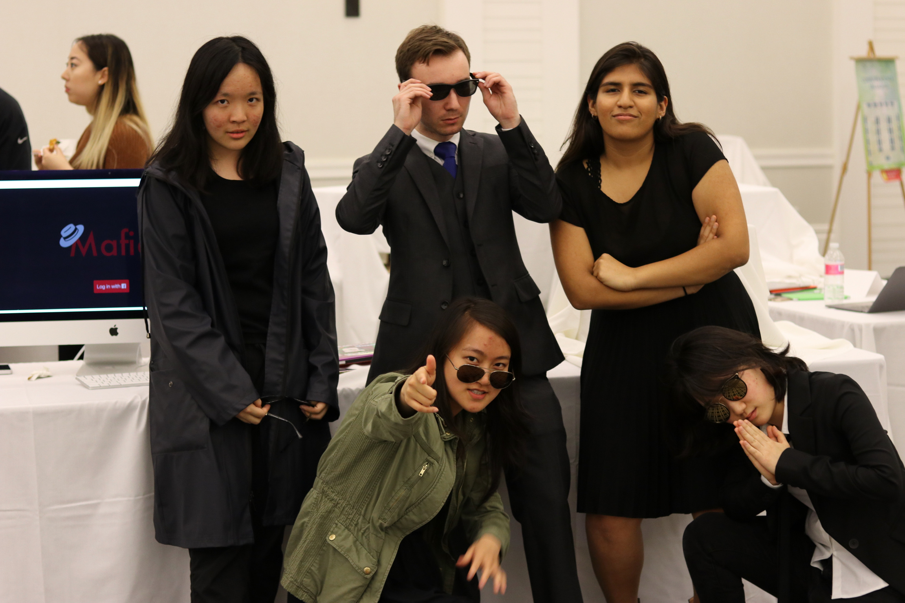
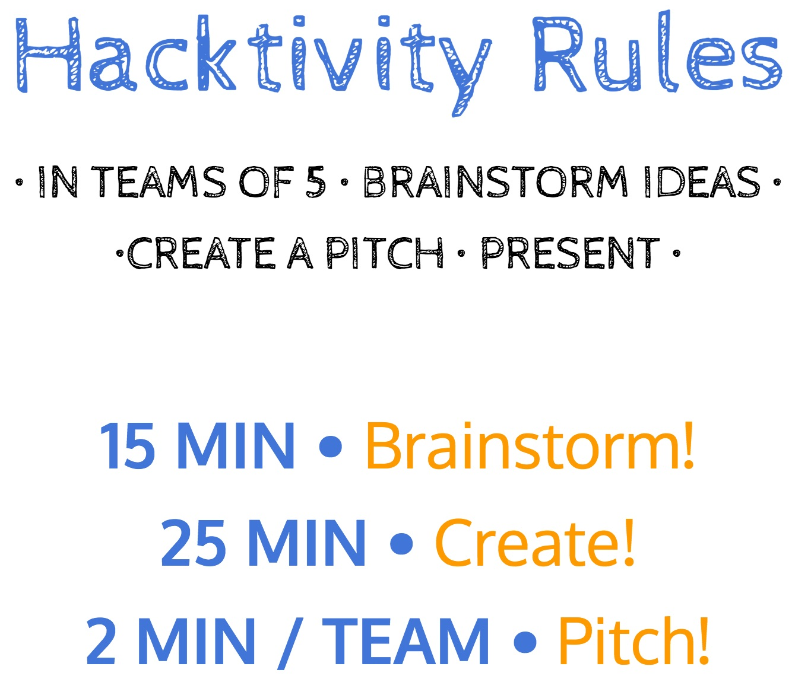

layout: true
class: center, middle
name: pic
background-size: contain

---

layout: true
class: center, top
name: fragment

.title[{{name}}]

---
layout: true
class: center, middle
name: base

.title[{{name}}]

---
name: CS98

<iframe width="600" height="400" src="https://www.youtube.com/embed/fd_9qwpzVBQ?rel=0&amp;showinfo=0" frameborder="0" allowfullscreen></iframe>

---
name: CS98

## Senior Design and Implementation Project

#### _the startup experience_

???
* a lot of you have had internships - working at a company
* academic course project experience
* but probably not a do your own startup experience
* try to make this as real as possible with best practices
* will be about you so if you have ideas on how to improve just talk to me

---
name: Online @

<iframe src="//giphy.com/embed/3oD3YveOJWdwIAfZ5e" width="600" height="389" frameBorder="0" class="giphy-embed"></iframe>


* web: [http://cs98.me](http://cs98.me)
* github: [http://github.com/dartmouth-cs98](http://github.com/dartmouth-98)

???

* administrative stuffs
* using github extensively, get comfortable
* previous projects on github and on the website


---
name: etc

.medium_small[]

* 3B — 4:30-6:20pm - Carson 61
* will use both Tues and Thurs for a variety of things
* x-hours
  * Mon 5:35 - 6:25pm
  * coding time + help time

???
* coding together
* activities such as bughunts and testing
* pitches
* inter and intra group collaboration
* time logs - for billing purposes


---
name: Code

.small[]

* the internet is full of the codes
* if (cite) { ~no penalty }
* else { mandatory vacation }

```javascript
// adapted from: http://stackoverflow.com/someurl
// this method does x and y
```

???
* internet full of codes is a good thing - we're all archeologists - puzzle solvers
* if copy - just cite it
* sharing is caring (when cited)
* want you to be able to show your work - have lots of green squares on github
* remember, I am hyper available, just talk to me


---
name: Slack

.small[]

* [https://cs98-dartmouth.slack.com](https://cs98-dartmouth.slack.com)!
* all course communication
* each team will have a channel
* download mobile, desktop, web apps
  * get used to it

???
* i don't do email well...

---
name: Grading

<iframe src="https://giphy.com/embed/KVeeqrI575N8A" width="480" height="271" frameBorder="0" class="giphy-embed" allowFullScreen></iframe>

* Project Milestones — 75%
  * milestone weights will vary
* Weekly Progress: Instructor Checkins + Written Logs — 25%
* Github pull requests and commits
* Project difficulty
* Individual contribution scaling vs Team grade

???
* may be adjusted slightly
* your grade my vary based on individual contribution (combined metric of time+feedback+participation+github)
* logs are like hour logs for  billing at a company - slightly annoying but keeps everybody on target - will be pretty easy


---
name: Project Complexity

<iframe src="https://giphy.com/embed/8xZp5BHGTNqYE" width="219" height="380" frameBorder="0" class="giphy-embed" allowFullScreen></iframe>

* code full system - no platforms as a services
* reasonable complexity - server/client/computation
* will discuss per project later


???
* some data persistance or computation
* some display of said data or computation that is reasonably complex
* it is two terms so you have time to implement something cool!
* don't worry we'll figure this out together


---
name: Monies

<iframe src="https://giphy.com/embed/l0HFkA6omUyjVYqw8" width="480" height="357" frameBorder="0" class="giphy-embed" allowFullScreen></iframe>

* some funding available
* 100 per team per term to start

???
* hosting
* hardware if necessary
* assets etc
* hindsite story: aws x-large instances racked up 300$ in a day


---
name: Commitment

<iframe src="https://giphy.com/embed/3oKIPnAiaMCws8nOsE" width="407" height="430" frameBorder="0" class="giphy-embed" allowFullScreen></iframe>

* coding time 10hrs a week min
* bonus points for working together
* class time (some of which can be coding time)

???


---
name: Tech Stacks


.large[]
*(remixed from [brianfalls.com](http://brianfalls.com/))*

???
* common question and every developers first dilemma - what tools to use
* one person on team django but really maybe not best tool
* how data is stored (persistance)
* how it is served
* how it is displayed
* client - mobile, web, game, IoT etc
* first couple of weeks trying out some different things - warm up


---
name: Potential Stacks

* no BAAS/PAAS allowed
* client-side:
  * web: HTML5, _react_, etc
  * desktop: native, _electron_, etc
  * mobile: native, _react-native_, etc
  * game/vr: _unity3d_, unreal, etc
  * IoT: _arduino_, raspberry pi, wearables, etc
* server-side:
  * _node_, _express_, rails, _flask_, django*
* hosting:
  * _Heroku_, _GitHub pages_, AWS, etc
* databases:
  * _MongoDB_, sqlite, RDS, MySQL, Postgres
* hardware:
  * buttons, eye tracking, vr, cameras, sensors!

And much much more

???
* hack-a-thing is exactly so you can play with some
* \*hate


---
name: From Scratch?!?

<iframe src="https://giphy.com/embed/OdwX6AhjmbN9C" width="480" height="364" frameBorder="0" class="giphy-embed" allowFullScreen></iframe>

* from blank terminal to full project
* worktime during most classtime
* can use libraries and frameworks

???
* we have 2 terms to build an awesome thing
* and learn how to do it right
* learning from past experiences so i can help avoid pitfalls from the past
* this will be the best cs98 to date
* starter projects can be helpful but also dangerous


---
name: How do we get there?

<iframe src="https://giphy.com/embed/ZgNQXIMhy2JCE" width="480" height="364" frameBorder="0" class="giphy-embed" allowFullScreen></iframe>

* hack-a-thing to get us warmed up
* then milestones to guide us
* github to keep us on track

???
* we'll just follow a simple recipe for success
* never had a team not have a successful working project


---
name: What is at the end?

#Project Demos!

.left[]

.right[]


???
* together with DALI
* 500+ people
* not presentations (science fair style)
* what to work towards
* show off your work!
* invite your friends!


---
name: this is git

.fancy.medium_small[]

???
* mandatory


---
name: git help

.small[]

* [https://onlywei.github.io/explain-git-with-d3/](https://onlywei.github.io/explain-git-with-d3/)
* [http://www.ndpsoftware.com/git-cheatsheet.html](http://www.ndpsoftware.com/git-cheatsheet.html)

???


---
name: Problems to Solve

<iframe src="https://giphy.com/embed/c5eqVJN7oNLTq" width="380" height="272" frameBorder="0" class="giphy-embed" allowFullScreen></iframe>

* Considerations
  * Novelty: explore something new(ish)
  * Impact: bigger than here
  * Format: game, web, mobile, iot, wearable, etc

???
* some of you have ideas, don't worry but take a step back and do some more ideating
* Think outside of what is useful to Dartmouth students
* startup advice is wrong - don't always have to solve a problem you yourself face
* new event apps, social network clones, and marketplaces have been attempted before and you might find it more rewarding to build something that challenges you.
* sometimes can't be solved - event planning for instance - just needs everybody to use the same platform


---
name: Outside the Box?

<iframe src="https://giphy.com/embed/ZhypAXYqYPS7e" width="283" height="380" frameBorder="0" class="giphy-embed" allowFullScreen></iframe>

* if you had half a year to build anything you want?
* why build something boring?

???


---
name: Previous Project: Hindsite


.medium[]

???
* better history chrome extension
* full text search of every page you've visited - previews


---
name: Previous Project: Climb.AR


.medium[]

???
* climbing game platform
* uses kinect and camera to identify holds, and provide a unity library for event based game building


---
name: Previous Project: Lensflare


.small[]

???
* HoloLens app to allow spatial annotations with text, video and 3D animated assets
* has a backend and management interface to allow easily adding/customizing assets

---
name: Previous Project: Queue


.medium[]

???
* ios app that allows sharing music playlist based on bluetooth distance
* in the same room, share your playlist / add tracks to others


---
name: The Tale Of Pretty Music Maker


.medium[]

???
* web loop music creator
* a 2 week cs52 project
* regretted their project in 98
* and wished they had worked on something more engaging like prettymusicmaker
* was almost like they were completely different people when they enjoyed the project


---
name: just breathe

<iframe src="https://giphy.com/embed/mZHDnUBJsQ9xu" width="480" height="204" frameBorder="0" class="giphy-embed" allowFullScreen></iframe>


---
name:

.medium[]


---
name: next steps

.medium_small[]

* [Hack-a-thing-1](https://canvas.dartmouth.edu/courses/22238/assignments/111997)
  * in pairs
  * choose some technology based on interesting
  * hack something together

???
* idea is to broaden your horizons
* choose something you'd like to learn
* potentially could be related to an idea you have
  * but don't get tooo attached
